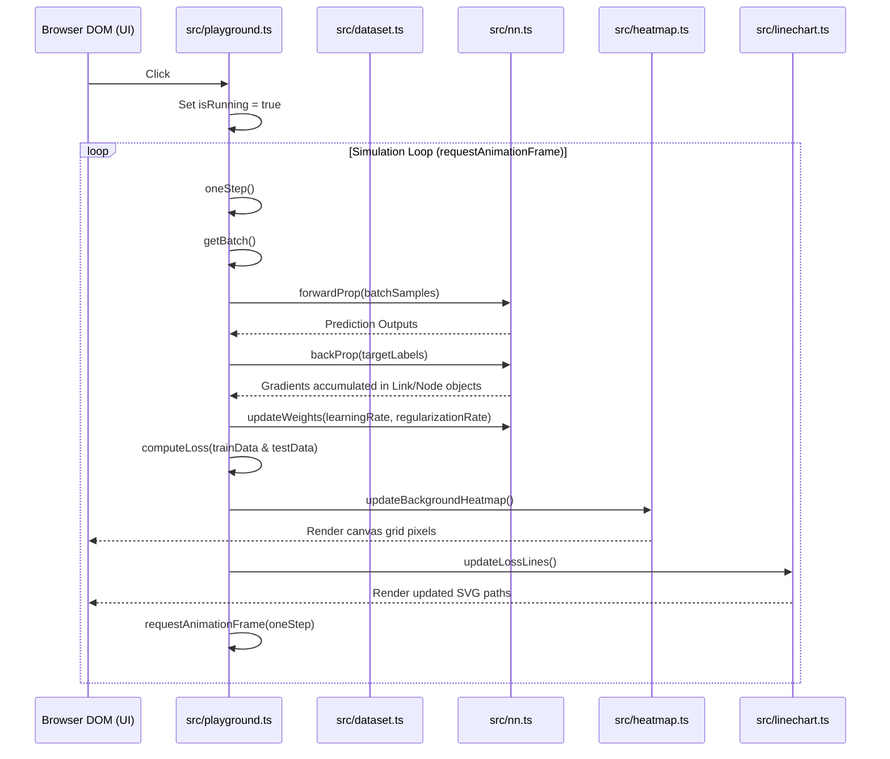
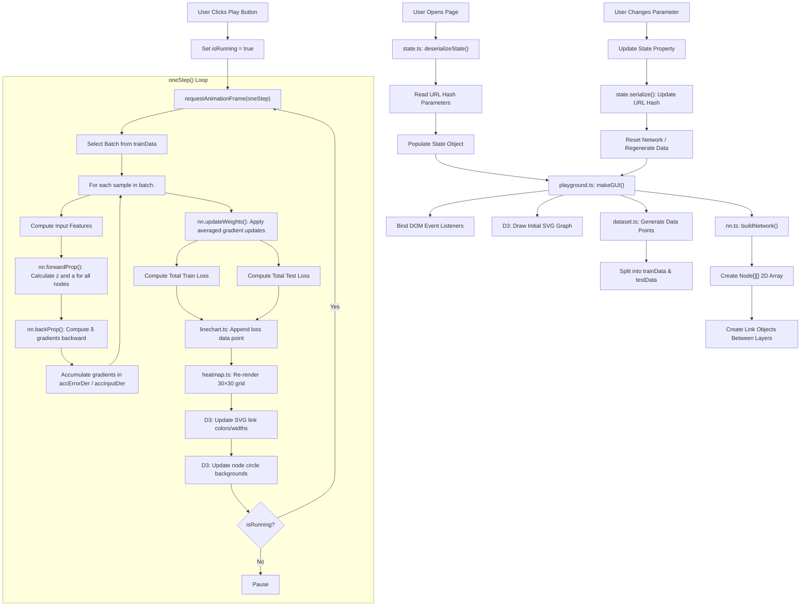
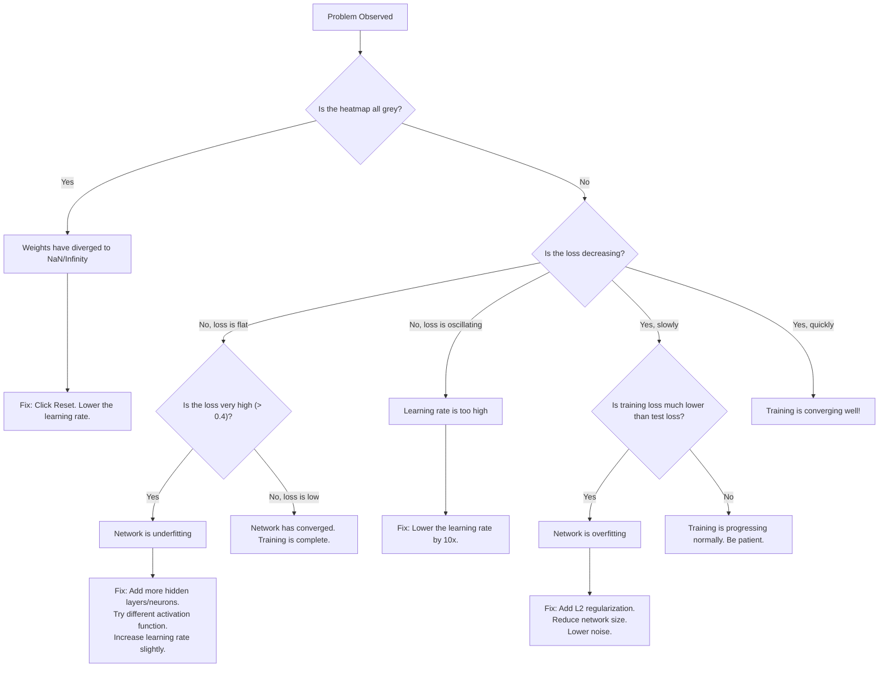
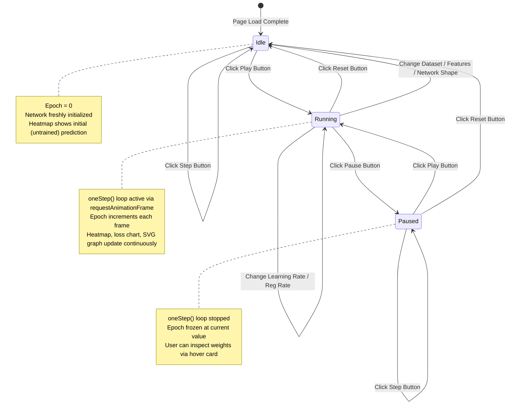
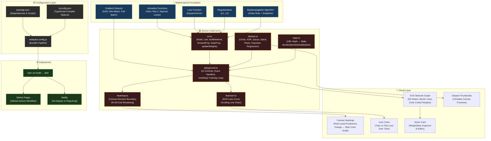

# Software Requirements Specification (SRS)
## Project: Deep Playground (Interactive Neural Network Visualization)

---

## 1. Introduction & Comprehensive Vision

### 1.1 Document Purpose
This document constitutes the absolute, definitive, and exhaustive Software Requirements Specification (SRS) for the **Deep Playground** application. It serves as the single source of truth and comprehensive technical manual for a **single developer** managing all stages of the software lifecycle—including core mathematical engines, real-time visualization renderers, HTML5 SVG canvas builders, serialization layers, and production deployment scripts.

In contrast to conventional corporate SRS documents which focus on team processes, tickets, and cross-functional handoffs, this specification is tailored to prioritize:
*   **Actionable Technical Design**: Exhaustive descriptions of functions, data structures, and algorithms.
*   **Mathematical Foundations**: Proofs, derivatives, and algorithmic mappings.
*   **Visual Logic Specs**: Canvas pixel mapping, D3 SVG node graphs, and responsive layout styles.
*   **Operational Readiness**: Zero-cost deployment configurations (GitHub Pages and Netlify).

This document is also designed to be **highly accessible for beginners**. Every machine learning concept, mathematical function, and programming design pattern is explained from first principles, ensuring that a student or a developer new to neural networks can understand the codebase and requirements.

### 1.2 Project Scope & Pedagogical Goals
Deep Playground is an educational, interactive, client-side simulator for artificial neural networks. The application requires no backend servers, database systems, or external computational resources. It runs entirely on the browser's main execution thread, delivering real-time feedback through interactive visualization.

The primary pedagogical goals of the project are:
1.  **Demystify Deep Learning**: Break down the "black box" nature of neural networks by showing how weights, biases, and features change dynamically during training.
2.  **Provide Intuitive Hyperparameter Tuning**: Allow users to instantly see how parameters like learning rate, activation function, regularization type, and batch size influence convergence speed and decision boundaries.
3.  **Demonstrate Feature Engineering**: Show the impact of feeding raw features ($x_1, x_2$) versus engineered features ($x_1^2, x_2^2, x_1 x_2, \sin(x_1), \sin(x_2)$) on various dataset complexities.
4.  **Visualize Underfitting and Overfitting**: Allow users to configure networks that are either too simple (underfitting) or too complex with high noise and no regularization (overfitting), and observe the results.

### 1.3 System Overview & User Archetypes
The application is structured as a Single Page Application (SPA). The interface is divided into functional columns that map the sequence of data flow: from dataset generation, to feature selection, to hidden layer configuration, and finally to prediction output.

We target two main user archetypes:
*   **The Learner/Student**: Wants to play with parameters, click the play button, and watch the boundaries shape. They need high-speed rendering, clean visuals, and an easy-to-use interface.
*   **The Educator/Developer (You)**: Wants to adapt the visual controls to specific lectures or extend the codebase with custom datasets, activation functions, or optimizers. They require clean codebase separation, static assets, and an easy deployment process.

---

## 2. Machine Learning Primer for Beginners

This section introduces the foundational theory of neural networks. If you are a beginner, reading this will help you understand why the code in `nn.ts` and `dataset.ts` is structured the way it is.

### 2.1 What is a Neural Network?
A neural network is a collection of mathematical "neurons" organized in layers. The network takes inputs, passes them through hidden layers, and computes a final prediction. 

#### The Analogy: Predicting a House Price
Imagine you want to predict the price of a house.
*   **Inputs (Features)**: Size of the house ($x_1$) and number of bedrooms ($x_2$).
*   **Weights ($w$)**: The importance of each feature. Perhaps house size is highly important ($w_1 = 300$), while the number of bedrooms is less important ($w_2 = 50$).
*   **Bias ($b$)**: The baseline price of a house, even if size and bedrooms are zero ($b = 80$).
*   **Neuron Equation**:
    $$\text{Price} = (300 \cdot x_1) + (50 \cdot x_2) + 80$$
This is a simple linear neuron. To learn complex patterns (like circles or spirals), we must wrap this sum in a non-linear function called an **activation function**.

### 2.2 Feedforward Pass: Step-by-Step
In a multi-layer network, data flows from left to right.
1.  **Input Layer**: Receives features from the dataset.
2.  **Hidden Layer 1**: Each neuron calculates a weighted sum of the inputs, adds its bias, and applies an activation function. The result is its output value.
3.  **Hidden Layer 2**: Each neuron takes the outputs of Hidden Layer 1 as its inputs, calculates its own weighted sum and bias, and applies its activation function.
4.  **Output Layer**: Produces the final prediction of the network.

### 2.3 Training: Loss, Backpropagation, and Gradient Descent
Training is the process of adjusting weights and biases to make predictions more accurate.
1.  **Calculate Loss (Error)**: We compare the network's prediction against the true label from the dataset. If the network predicts $+0.2$ but the actual label is $+1.0$, the error is:
    $$\text{Error} = \frac{1}{2}(0.2 - 1.0)^2 = 0.32$$
2.  **Backpropagation**: We calculate the gradient of the error with respect to each parameter. This tells us whether increasing or decreasing a weight will reduce the error.
3.  **Weight Update**: We subtract a small fraction (the **learning rate**) of the gradient from each weight:
    $$\text{New Weight} = \text{Old Weight} - (\text{Learning Rate} \times \text{Gradient})$$
By repeating this process hundreds of times, the weights adjust until the network makes accurate predictions.

---

## 3. Mathematical Specifications & Derivations

This section provides the complete mathematical framework of the simulator.

### 3.1 Neuron Activation Formulas
For a neuron $i$ in layer $L$, the pre-activation input $z_i^{(L)}$ and activated output $a_i^{(L)}$ are defined as:

$$z_i^{(L)} = b_i^{(L)} + \sum_{j} w_{ji}^{(L)} \cdot a_j^{(L-1)}$$

$$a_i^{(L)} = \sigma(z_i^{(L)})$$

Where:
*   $b_i^{(L)}$ is the bias of neuron $i$ in layer $L$.
*   $w_{ji}^{(L)}$ is the connection weight from neuron $j$ in layer $L-1$ to neuron $i$ in layer $L$.
*   $a_j^{(L-1)}$ is the output of neuron $j$ in the previous layer.
*   $\sigma$ is the activation function.

---

### 3.2 Activation Functions and Derivatives

#### 1. Hyperbolic Tangent (Tanh)
Tanh squashes real-valued numbers to the range $(-1, 1)$.
*   **Formula**:
    $$\sigma(x) = \tanh(x) = \frac{e^x - e^{-x}}{e^x + e^{-x}} = \frac{e^{2x} - 1}{e^{2x} + 1}$$
*   **Derivative**:
    $$\sigma'(x) = 1 - \tanh^2(x) = 1 - \sigma(x)^2$$

*   **Detailed Algebraic Derivation**:
    Recall that the definition of the hyperbolic tangent function is the ratio of hyperbolic sine to hyperbolic cosine:
    $$\tanh(x) = \frac{\sinh(x)}{\cosh(x)}$$
    Let $u(x) = \sinh(x)$ and $v(x) = \cosh(x)$. We know that:
    $$\frac{d}{dx}\sinh(x) = \cosh(x) \quad \text{and} \quad \frac{d}{dx}\cosh(x) = \sinh(x)$$
    Applying the quotient rule for derivatives, which is defined as:
    $$\frac{d}{dx}\left(\frac{u}{v}\right) = \frac{u'v - uv'}{v^2}$$
    We substitute our terms into the quotient formula:
    $$\frac{d}{dx}\tanh(x) = \frac{\cosh(x)\cosh(x) - \sinh(x)\sinh(x)}{\cosh^2(x)} = \frac{\cosh^2(x) - \sinh^2(x)}{\cosh^2(x)}$$
    Using the identity $\cosh^2(x) - \sinh^2(x) = 1$, we simplify the numerator:
    $$\frac{d}{dx}\tanh(x) = \frac{1}{\cosh^2(x)}$$
    We can rewrite this fraction:
    $$\frac{1}{\cosh^2(x)} = \frac{\cosh^2(x) - \sinh^2(x)}{\cosh^2(x)} = \frac{\cosh^2(x)}{\cosh^2(x)} - \frac{\sinh^2(x)}{\cosh^2(x)} = 1 - \tanh^2(x)$$
    Thus, we obtain the derivative:
    $$\sigma'(x) = 1 - \sigma(x)^2$$

*   **Alternative Proof using Exponential Forms**:
    Let us write the Tanh function in its exponential form directly:
    $$f(x) = \frac{e^x - e^{-x}}{e^x + e^{-x}}$$
    Let $u = e^x - e^{-x}$ and $v = e^x + e^{-x}$. Their derivatives are:
    $$u' = e^x + e^{-x} = v \quad \text{and} \quad v' = e^x - e^{-x} = u$$
    Applying the quotient rule:
    $$f'(x) = \frac{v \cdot v - u \cdot u}{v^2} = \frac{v^2 - u^2}{v^2} = 1 - \frac{u^2}{v^2} = 1 - \left( \frac{u}{v} \right)^2 = 1 - \tanh^2(x)$$
    This matches our previous derivation.

#### 2. Rectified Linear Unit (ReLU)
ReLU replaces negative values with zero, allowing for faster computation and sparser activations.
*   **Formula**:
    $$\sigma(x) = \max(0, x)$$
*   **Derivative**:
    $$\sigma'(x) = \begin{cases} 0 & \text{if } x \le 0 \\ 1 & \text{if } x > 0 \end{cases}$$

*   **Detailed Algebraic Derivation**:
    For $x > 0$, the function simplifies to $f(x) = x$, whose derivative is $1$. For $x < 0$, the function simplifies to $f(x) = 0$, whose derivative is $0$. At $x = 0$, the function is mathematically non-differentiable; however, in practice (and in code), we define the derivative at $0$ as $0$ to maintain stability.

#### 3. Sigmoid
Sigmoid squashes input values to the range $(0, 1)$, which is useful for binary classification probabilities.
*   **Formula**:
    $$\sigma(x) = \frac{1}{1 + e^{-x}}$$
*   **Derivative**:
    $$\sigma'(x) = \sigma(x)(1 - \sigma(x))$$

*   **Detailed Algebraic Derivation**:
    Let us write the sigmoid function using negative powers:
    $$\sigma(x) = (1 + e^{-x})^{-1}$$
    To find the derivative, we apply the power rule combined with the chain rule:
    $$\sigma'(x) = -1 \cdot (1 + e^{-x})^{-2} \cdot \frac{d}{dx}(1 + e^{-x})$$
    The derivative of the inner function $1 + e^{-x}$ with respect to $x$ is:
    $$\frac{d}{dx}(1 + e^{-x}) = -e^{-x}$$
    Substituting this back into our expression:
    $$\sigma'(x) = -(1 + e^{-x})^{-2} \cdot (-e^{-x}) = \frac{e^{-x}}{(1 + e^{-x})^2}$$
    We can expand the fraction into the product of two separate terms:
    $$\sigma'(x) = \left( \frac{1}{1 + e^{-x}} \right) \cdot \left( \frac{e^{-x}}{1 + e^{-x}} \right)$$
    The first term is the original sigmoid function $\sigma(x)$. Let us rewrite the second term:
    $$\frac{e^{-x}}{1 + e^{-x}} = \frac{1 + e^{-x} - 1}{1 + e^{-x}} = \frac{1 + e^{-x}}{1 + e^{-x}} - \frac{1}{1 + e^{-x}} = 1 - \sigma(x)$$
    Substituting these back, we get:
    $$\sigma'(x) = \sigma(x)(1 - \sigma(x))$$

#### 4. Linear
Linear activations pass the input sum directly to the output.
*   **Formula**:
    $$\sigma(x) = x$$
*   **Derivative**:
    $$\sigma'(x) = 1$$

---

### 3.3 Loss Function Derivation
Deep Playground calculates prediction error using the Square Loss function:
$$E = \frac{1}{2} (a^{(L_{out})} - y)^2$$
Where $a^{(L_{out})}$ is the final output layer neuron's output, and $y$ is the actual target label.

The derivative of the loss with respect to the output activation is:
$$\frac{\partial E}{\partial a^{(L_{out})}} = a^{(L_{out})} - y$$

---

### 3.4 Backpropagation Derivation
To update weights and biases, we must find the derivative of the loss $E$ with respect to each parameter.

Let the error gradient for neuron $i$ in layer $L$ be:
$$\delta_i^{(L)} = \frac{\partial E}{\partial z_i^{(L)}}$$

#### 1. For Output Layer ($L = L_{out}$)
Using the chain rule:
$$\delta_i^{(L_{out})} = \frac{\partial E}{\partial z_i^{(L_{out})}} = \frac{\partial E}{\partial a_i^{(L_{out})}} \cdot \frac{\partial a_i^{(L_{out})}}{\partial z_i^{(L_{out})}}$$
Since $a_i^{(L_{out})} = \sigma(z_i^{(L_{out})})$:
$$\delta_i^{(L_{out})} = (a_i^{(L_{out})} - y) \cdot \sigma'(z_i^{(L_{out})})$$

#### 2. For Hidden Layers ($L < L_{out}$)
Each hidden neuron $i$ in layer $L$ connects to all neurons $k$ in the next layer $L+1$.
$$\delta_i^{(L)} = \frac{\partial E}{\partial z_i^{(L)}} = \sum_{k} \left( \frac{\partial E}{\partial z_k^{(L+1)}} \cdot \frac{\partial z_k^{(L+1)}}{\partial a_i^{(L)}} \right) \cdot \frac{\partial a_i^{(L)}}{\partial z_i^{(L)}}$$
Since $z_k^{(L+1)} = b_k^{(L+1)} + \sum_{j} w_{jk}^{(L+1)} a_j^{(L)}$:
$$\frac{\partial z_k^{(L+1)}}{\partial a_i^{(L)}} = w_{ik}^{(L+1)}$$
Substituting this back in:
$$\delta_i^{(L)} = \left( \sum_{k} \delta_k^{(L+1)} w_{ik}^{(L+1)} \right) \cdot \sigma'(z_i^{(L)})$$

#### 3. Gradient of Parameters
Now we calculate the derivatives with respect to the individual weights and biases:
$$\frac{\partial E}{\partial w_{ji}^{(L)}} = \frac{\partial E}{\partial z_i^{(L)}} \cdot \frac{\partial z_i^{(L)}}{\partial w_{ji}^{(L)}} = \delta_i^{(L)} \cdot a_j^{(L-1)}$$
$$\frac{\partial E}{\partial b_i^{(L)} = \delta_i^{(L)}$$

---

### 3.5 Regularization Formulas (L1 and L2)
Regularization adds a penalty to the weights to keep them small, which prevents overfitting.

#### L1 Regularization (Lasso)
*   **Formula**:
    $$R(w) = |w|$$
*   **Derivative**:
    $$R'(w) = \text{sign}(w) = \begin{cases} -1 & w < 0 \\ 1 & w > 0 \\ 0 & w = 0 \end{cases}$$

#### L2 Regularization (Ridge)
*   **Formula**:
    $$R(w) = \frac{1}{2} w^2$$
*   **Derivative**:
    $$R'(w) = w$$

---

### 3.6 Matrix Proof of Linear Network Collapse
A common question for beginners is: *Why can we not build deep neural networks using only Linear activation functions?*
Here is the step-by-step mathematical proof showing that any deep neural network with purely linear activation functions collapses into a single-layer linear model.

Let us represent the layers of the network using matrix algebra.
Let the input vector be $X$.
For Layer 1, the output vector $A^{(1)}$ is:
$$A^{(1)} = \sigma(W_1 X + B_1)$$
Since the activation function is linear ($\sigma(z) = z$), this simplifies to:
$$A^{(1)} = W_1 X + B_1$$

For Layer 2, the output vector $A^{(2)}$ is:
$$A^{(2)} = \sigma(W_2 A^{(1)} + B_2) = W_2 A^{(1)} + B_2$$

Now, substitute Layer 1's output equation into Layer 2's equation:
$$A^{(2)} = W_2 (W_1 X + B_1) + B_2$$
Expanding this expression:
$$A^{(2)} = (W_2 W_1) X + (W_2 B_1 + B_2)$$

Let us define new parameters:
*   $W' = W_2 W_1$ (which is a single matrix product representing new combined weights).
*   $B' = W_2 B_1 + B_2$ (which is a single vector sum representing new combined biases).

Substituting these back into the Layer 2 equation:
$$A^{(2)} = W' X + B'$$

This shows that the two linear layers are mathematically equivalent to a single linear layer with weights $W'$ and biases $B'$. Extending this to $N$ layers, the product of $N$ linear weight matrices collapses into a single matrix:
$$W_{final} = W_N W_{N-1} \dots W_1$$
This is why non-linear activation functions (like Tanh, ReLU, or Sigmoid) are required: they prevent this mathematical collapse, allowing the network to learn complex, non-linear relationships.

---

## 4. Detailed File-by-File & Function-by-Function Walkthrough

This section provides a detailed walk-through of the codebase, detailing every class, interface, and function in the `src/` folder.

```
src/
├── dataset.ts       <-- Data Generators (Circle, XOR, Gauss, Spiral)
├── nn.ts            <-- Mathematical Core (Nodes, Links, Backprop)
├── state.ts         <-- Global Configurations & URL Hash Manager
├── playground.ts    <-- UI Controls and Main Simulation Loop
├── heatmap.ts       <-- renders Decision Boundary background
├── linechart.ts     <-- renders Loss Curves (Train/Test Loss)
└── seedrandom.d.ts  <-- TypeScript typings for deterministic random seeds
```

---

### 4.1 Detailed Analysis of `src/nn.ts`

This file contains the classes that model the neural network's structure and implement backpropagation.

#### 1. Class: `Node`
Represents a single neuron.
*   **Fields**:
    *   `id: string`: Unique node identifier.
    *   `inputLinks: Link[]`: List of connection links feeding into this node.
    *   `bias: number`: The bias value. Initialized to $0.1$ (or $0.0$ if `initZero` is true).
    *   `outputs: Link[]`: List of outgoing connection links.
    *   `totalInput: number`: Stores $z_i^{(L)}$, the weighted sum of inputs plus bias.
    *   `output: number`: Stores $a_i^{(L)}$, the activated output of the node.
    *   `outputDer: number`: The derivative of the loss with respect to the output ($\frac{\partial E}{\partial a}$).
    *   `inputDer: number`: The derivative of the loss with respect to the pre-activation input ($\delta_i^{(L)}$).
    *   `accInputDer: number`: Accumulates input derivatives across a batch.
    *   `numAccumulatedDers: number`: Tracks the number of samples accumulated in the current batch.
    *   `activation: ActivationFunction`: Reference to the node's activation function.
*   **Methods**:
    *   `updateOutput(): number`:
        Calculates $z = b + \sum (w_{ji} \cdot a_j)$. Updates `this.totalInput` and computes `this.output = activation.output(z)`. Returns the output.

#### 2. Class: `Link`
Represents a connection weight between two nodes.
*   **Fields**:
    *   `id: string`: Unique link ID generated as `source.id + "-" + dest.id`.
    *   `source: Node`: The source neuron.
    *   `dest: Node`: The destination neuron.
    *   `weight: number`: The weight value. Initialized to a random value between $-0.5$ and $0.5$.
    *   `isDead: boolean`: Set to `true` if L1 regularization drives the weight to 0.
    *   `errorDer: number`: The derivative of the loss with respect to this weight ($\frac{\partial E}{\partial w}$).
    *   `accErrorDer: number`: Accumulator for weight derivatives across a batch.
    *   `numAccumulatedDers: number`: Tracks the number of accumulated derivatives in the current batch.
    *   `regularization: RegularizationFunction`: Penalty function (L1, L2, or null).

#### 3. Core Engine Functions

##### Function: `buildNetwork`
```typescript
export function buildNetwork(
    networkShape: number[], activation: ActivationFunction,
    outputActivation: ActivationFunction,
    regularization: RegularizationFunction,
    inputIds: string[], initZero?: boolean): Node[][]
```
*   **What it does**: Dynamically constructs the neural network layer by layer.
*   **Algorithm**:
    1. Creates a 2D array of nodes (`Node[][]`).
    2. Iterates through `networkShape` (which specifies the number of nodes per layer).
    3. Instantiates `Node` objects for each layer. Input layer nodes are assigned IDs from `inputIds`.
    4. For all layers after the input layer, it creates a `Link` object connecting every node in the previous layer to every node in the current layer.
    5. Appends links to the previous node's `outputs` array and the current node's `inputLinks` array.

##### Function: `forwardProp`
```typescript
export function forwardProp(network: Node[][], inputs: number[]): number
```
*   **What it does**: Computes the output of the network for a given input sample.
*   **Algorithm**:
    1. Assigns the input array values directly to the outputs of the input layer nodes.
    2. Iterates forward through the hidden layers and the output layer.
    3. Calls `node.updateOutput()` on each node, calculating the output value of the network.
    4. Returns the output of the final layer's single node.

##### Function: `backProp`
```typescript
export function backProp(network: Node[][], target: number, errorFunc: ErrorFunction): void
```
*   **What it does**: Computes the local error gradients ($\delta$) for all nodes and weights.
*   **Algorithm**:
    1. Calculates the output derivative of the final node using the loss function: `outputNode.outputDer = errorFunc.der(outputNode.output, target)`.
    2. Iterates backward through the layers starting from the output layer.
    3. For each node, computes `node.inputDer = node.outputDer * node.activation.der(node.totalInput)`.
    4. Accumulates the derivative: `node.accInputDer += node.inputDer`.
    5. For each input link connected to the node, calculates the weight error derivative: `link.errorDer = node.inputDer * link.source.output` and adds it to the accumulator: `link.accErrorDer += link.errorDer`.
    6. For all layers except the first hidden layer, calculates the backpropagated error for the previous layer: `prevNode.outputDer += link.weight * link.dest.inputDer`.

##### Function: `updateWeights`
```typescript
export function updateWeights(network: Node[][], learningRate: number, regularizationRate: number)
```
*   **What it does**: Updates weights and biases using the accumulated gradients.
*   **Algorithm**:
    1. Iterates through all layers starting from the first hidden layer.
    2. For each node, updates its bias: `node.bias -= learningRate * (node.accInputDer / node.numAccumulatedDers)`.
    3. Resets bias accumulators to 0.
    4. For each input link of the node, calculates the regularization derivative if active.
    5. Updates the weight: `link.weight -= (learningRate / link.numAccumulatedDers) * link.accErrorDer`.
    6. Applies regularization: `newWeight = link.weight - (learningRate * regularizationRate) * regulDer`.
    7. If L1 regularization causes the weight to cross zero, sets the weight to exactly 0 and sets `link.isDead = true`. Otherwise, updates the weight value.
    8. Resets link accumulators to 0.

---

### 4.2 Detailed Analysis of `src/state.ts`

This file handles serializing the application state into the URL hash, allowing users to save and share specific configurations.

#### 1. Enumerations:
*   `Type`: Indicates how variables are serialized. Values include `STRING`, `NUMBER`, `ARRAY_NUMBER`, `ARRAY_STRING`, `BOOLEAN`, and `OBJECT`.
*   `Problem`: Specifies the task type. Either `CLASSIFICATION` or `REGRESSION`.

#### 2. Class: `State`
Maintains the configuration state of the playground.
*   **Static Property registry `PROPS`**:
    Maps state properties to their serialization types and option lookups. For example:
    ```typescript
    {name: "activation", type: Type.OBJECT, keyMap: activations}
    ```
*   **Key Methods**:
    *   `static deserializeState(): State`:
        1. Reads the URL hash fragment (`window.location.hash`).
        2. Splits parameters using the `&` delimiter and key-value pairs using `=`.
        3. Iterates through the registered properties, parsing and converting values based on their types.
        4. Dynamically reconstructs properties that hide specific UI elements (keys ending in `_hide`).
        5. If no seed is present, generates a random seed and configures `Math.seedrandom`.
        6. Returns the populated `State` object.
    *   `serialize()`:
        1. Iterates through all properties in `PROPS`.
        2. Converts object lookups back to keys and arrays back to comma-separated strings.
        3. Appends properties that hide UI components.
        4. Joins the serialized key-value pairs with `&` and updates `window.location.hash`.

*   **Array Parsing and Serialization Safety Details**:
    The deserialization method inside `state.ts` implements a local helper function to handle arrays safely:
    ```typescript
    function parseArray(value: string): string[] {
      return value.trim() === "" ? [] : value.split(",");
    }
    ```
    This function splits comma-separated configuration string arrays (e.g. `networkShape=4,2` representing the hidden layer sizes). By checking `value.trim() === ""`, it handles cases where the array parameter is empty, returning a safe empty array `[]` instead of throwing a parsing exception.

---

### 4.3 Detailed Analysis of `src/dataset.ts`

This file handles generating datasets, adding noise, and splitting data into training and test sets.

#### 1. Algorithms for Classification Data Generators

##### Function: `classifyCircleData`
```typescript
export function classifyCircleData(numSamples: number, noise: number): Example2D[]
```
*   **How it works**:
    *   Generates points inside a circle of radius 5.
    *   Points with a distance of $< 2.5$ from the origin $(0,0)$ are labeled $+1$ (positive).
    *   Points with a distance between $3.5$ and $5.0$ are labeled $-1$ (negative).
    *   Adds random noise using uniform offsets scaled by the noise value.

##### Function: `classifyXORData`
```typescript
export function classifyXORData(numSamples: number, noise: number): Example2D[]
```
*   **How it works**:
    *   Generates random points $(x,y)$ in the range $[-5, 5]$.
    *   Adds a padding of $0.3$ to keep points away from the axes.
    *   Points in diagonal quadrants (where $x \cdot y \ge 0$) are labeled $+1$. Points in opposite quadrants are labeled $-1$.
    *   Applies random noise offsets to the coordinates.

##### Function: `classifyTwoGaussData`
```typescript
export function classifyTwoGaussData(numSamples: number, noise: number): Example2D[]
```
*   **How it works**:
    *   Generates two separate Gaussian clusters.
    *   Cluster 1 is centered at $(2, 2)$ and labeled $+1$.
    *   Cluster 2 is centered at $(-2, -2)$ and labeled $-1$.
    *   Applies a variance scale using D3's linear scale to map noise values between $0$ and $0.5$ to variance values between $0.5$ and $4.0$.

##### Function: `classifySpiralData`
```typescript
export function classifySpiralData(numSamples: number, noise: number): Example2D[]
```
*   **How it works**:
    *   Generates coordinates using polar equations.
    *   Spiral 1 (Positive): Uses points generated along the curve $r = \frac{i}{n} \cdot 5$, with angle $t = 1.75 \cdot \frac{i}{n} \cdot 2\pi$.
    *   Spiral 2 (Negative): Uses the same radius calculations but shifts the angle by $\pi$ radians ($180^\circ$).
    *   Adds uniform random noise offsets to coordinates.

#### 2. Algorithms for Regression Data Generators

##### Function: `regressPlane`
```typescript
export function regressPlane(numSamples: number, noise: number): Example2D[]
```
*   **How it works**:
    *   Generates random coordinates $(x,y)$ in the range $[-6, 6]$.
    *   Computes targets using the function $z = x + y$, mapped to labels between $-1.0$ and $+1.0$.
    *   Adds noise offsets to the input coordinates before calculating the label.

##### Function: `regressGaussian`
```typescript
export function regressGaussian(numSamples: number, noise: number): Example2D[]
```
*   **How it works**:
    *   Defines six Gaussian center coordinates in the 2D space.
    *   For a random coordinate $(x,y)$, calculates the output height by taking the maximum radial influence from these center points.
    *   Adds noise offsets to coordinates before computing the final target height.

#### 3. Mathematical Helper Functions
*   `normalRandom(mean, variance)`: Generates random numbers with a normal distribution using the Box-Muller transform:
    $$Z = \sqrt{-2 \ln(S) / S} \cdot V_1$$
*   `shuffle(array)`: Implements the Fisher-Yates shuffle algorithm to mix datasets deterministically using `Math.random`.

---

### 4.4 Detailed Analysis of `src/playground.ts`

This is the main orchestrator script that controls the application.

#### Key Setup and Initialization Steps:
1.  **State Loading**: Calls `State.deserializeState()` to load url parameters.
2.  **D3 Selections**: Selects DOM controls (buttons, select menus, range sliders) and binds event handlers.
3.  **Dynamic Feature Checkboxes**: Selects feature inputs ($x_1, x_2, x_1^2$, etc.) and updates state variables on click.
4.  **Dataset Construction**: Triggers dataset generation based on the active dataset property in `state`.
5.  **D3 Network Graph Initialization**: Draws the network graph structure (inputs, hidden layers, connections, output node) inside the SVG container using D3.

#### The Simulation Cycle:
The core loop is driven by the `oneStep()` function:
```typescript
function oneStep() {
  // 1. Get batch sample
  let batch = getBatch();
  
  // 2. Run Forward & Backprop for each item in the batch
  batch.forEach(sample => {
    let inputs = getInputs(sample);
    nn.forwardProp(network, inputs);
    nn.backProp(network, sample.label, nn.Errors.SQUARE);
  });
  
  // 3. Update weights and biases
  nn.updateWeights(network, state.learningRate, state.regularizationRate);
  
  // 4. Update metrics
  lossTrain = computeLoss(trainData);
  lossTest = computeLoss(testData);
  
  // 5. Trigger D3 redraws
  updateUI();
  
  // 6. Request next frame if running
  if (isRunning) {
    requestAnimationFrame(oneStep);
  }
}
```

---

### 4.5 Detailed Analysis of `src/heatmap.ts`

Handles rendering the continuous decision boundary.
*   **Drawing Mechanics**:
    *   Calculates predictions on a $30 \times 30$ grid mapping coordinates from $-6.0$ to $+6.0$.
    *   Iterates through each grid cell, passing inputs to `nn.forwardProp()`.
    *   Uses a color scale to map output values (typically between $-1$ and $+1$) to colors: orange for negative predictions and blue for positive predictions.
    *   Writes colors directly to a canvas pixel buffer (`ctx.putImageData`) for fast rendering.
    *   Draws the dataset points as small circles on top of the canvas.

---

### 4.6 Detailed Analysis of `src/linechart.ts`

Draws the real-time loss chart.
*   **Drawing Mechanics**:
    *   Maintains lists of historical training and test loss values.
    *   Appends path data points using D3 line generators:
        ```typescript
        let line = d3.svg.line()
            .x((d, i) => xScale(i))
            .y(d => yScale(d));
        ```
    *   Redraws the path element during updates to display the loss curve.

---

## 5. UI Control & Hash Serialization Mappings

The table below lists all UI controls, their associated HTML element IDs, class properties, and URL parameter keys.

| UI Component | HTML Element ID | `State` Property | URL Key | Data Type | Default | Values & Details |
| :--- | :--- | :--- | :--- | :--- | :--- | :--- |
| **Learning Rate** | `select#learningRate` | `learningRate` | `learningRate` | `NUMBER` | `0.03` | Step size: `0.00001` to `10`. |
| **Activation** | `select#activations` | `activation` | `activation` | `OBJECT` | `tanh` | `relu`, `tanh`, `sigmoid`, `linear`. |
| **Regularization** | `select#regularizations` | `regularization` | `regularization` | `OBJECT` | `none` | `none`, `L1`, `L2`. |
| **Reg. Rate** | `select#regularRate` | `regularizationRate` | `regularizationRate` | `NUMBER` | `0` | Penalty scale: `0` to `10`. |
| **Problem Type** | `select#problem` | `problem` | `problem` | `OBJECT` | `classification` | `classification` or `regression`. |
| **Dataset** | Canvas attributes | `dataset` / `regDataset` | `dataset` / `regDataset` | `OBJECT` | `circle` | `circle`, `xor`, `gauss`, `spiral`, `reg-plane`, `reg-gauss`. |
| **Ratio Train/Test** | `input#percTrainData` | `percTrainData` | `percTrainData` | `NUMBER` | `50` | Split percentage: `10` to `90`. |
| **Noise** | `input#noise` | `noise` | `noise` | `NUMBER` | `0` | Coordinate deviation: `0` to `50`. |
| **Batch Size** | `input#batchSize` | `batchSize` | `batchSize` | `NUMBER` | `10` | Samples per update: `1` to `30`. |
| **Network Shape** | Dynamic | `networkShape` | `networkShape` | `ARRAY` | `4,2` | Comma-separated neuron counts per layer. |

---

## 6. HTML & CSS Structural Layout Specifications

### 6.1 Layout Columns
The layout inside [index.html](file:///home/roxx/dev/playground/index.html) is split into a header, control bars, and four primary columns:

```
+-----------------------------------------------------------------------------+
| Header: Title and subtitle explaining the purpose of the playground.         |
+-----------------------------------------------------------------------------+
| Top Controls: Buttons for Reset, Play/Pause, Step, and dropdowns for        |
| Learning rate, Activation, Regularization, Regularization rate, and Problem type. |
+-----------------------------------------------------------------------------+
| Main Columns:                                                               |
| 1. Data          | 2. Features      | 3. Hidden Layers | 4. Output          |
| Select dataset,  | Toggle active    | Add/remove layers| Display losses,    |
| adjust split,    | inputs (X1, X2,  | and adjust neuron| render decision    |
| noise, and batch | x^2, sin(x), etc)| counts per layer.| boundary heatmap.  |
| size.            |                  |                  |                    |
+-----------------------------------------------------------------------------+
```

### 6.2 Responsive Design Rules
The application's styles in [styles.css](file:///home/roxx/dev/playground/styles.css) implement the following design rules:
1.  **Container Scaling**: The main content wrapper has a fixed width of `1024px` to prevent layout breaking on small screens. If the screen width is smaller than 1024px, the container shifts to display horizontal scrollbars.
2.  **Color Codes**:
    *   Positive values (outputs, predictions, positive weights) are colored **blue** (`#0877bd`).
    *   Negative values are colored **orange** (`#f59322`).
    *   Neutral values (near 0) are colored **white/grey** (`#e8eaeb`).
3.  **Typography**: Uses Google's **Roboto** font family (`Roboto:300,400,500`) for clean, modern legibility.

---

## 7. D3.js Visualization Engine Specification

### 7.1 SVG Representation and Mechanics
The network graph is constructed inside the `#svg` element.
*   **Links**: Rendered using SVG `<path>` elements. The stroke color reflects the weight value (blue for positive, orange for negative), and the line thickness is determined by its absolute value:
    ```typescript
    let thickness = Math.abs(link.weight) * 3;
    ```
*   **Neurons (Nodes)**: Rendered as circles. When training runs, the background color of each node represents its current output prediction value on a 2D color scale.
*   **Hover Card**: When hovering over a connection, D3 dynamically positions the `#hovercard` overlay at the cursor coordinate. Users can edit weight or bias values directly through an input field inside the card.

### 7.2 Color Scale Domains
The D3 color scales map predictions to visual colors:
```typescript
let colorScale = d3.scale.linear<string>()
    .domain([-1, 0, 1])
    .range(["#f59322", "#e8eaeb", "#0877bd"])
    .clamp(true);
```

### 7.3 Detailed D3 Data-Binding Explanation
For beginners, D3 selection binding works using a three-phase approach: `.data()`, `.enter()`, and `.exit()`. Here is how D3 manages layers and nodes:
1.  **D3 Selections**: Selecting existing DOM elements:
    ```typescript
    let layers = svg.selectAll("g.layer").data(networkShape);
    ```
2.  **Enter Phase**: If the length of the data array is larger than the existing DOM elements, D3 appends new elements to match:
    ```typescript
    layers.enter().append("g").attr("class", "layer");
    ```
3.  **Exit Phase**: If the data array shrinks, D3 deletes extra DOM elements:
    ```typescript
    layers.exit().remove();
    ```
This ensures the DOM is synchronized with the state variables.

---

## 8. Detailed DOM Hierarchy Document

Below is the structured layout of all key elements in `index.html` used by the application scripts:

```
body
├── a.github-link
├── header (Title)
├── div#top-controls
│   ├── button#reset-button
│   ├── button#play-pause-button
│   ├── button#next-step-button
│   ├── select#learningRate
│   ├── select#activations
│   ├── select#regularizations
│   ├── select#regularRate
│   └── select#problem
└── div#main-part
    ├── div.column.data
    │   ├── canvas[data-dataset="circle"]
    │   ├── canvas[data-dataset="xor"]
    │   ├── canvas[data-dataset="gauss"]
    │   ├── canvas[data-dataset="spiral"]
    │   ├── input#percTrainData
    │   ├── input#noise
    │   └── input#batchSize
    ├── div.column.features (Input checkboxes)
    ├── div.column.hidden-layers
    │   ├── button#add-layers
    │   └── button#remove-layers
    └── div.column.output
        ├── div#linechart
        ├── div#heatmap
        ├── input#show-test-data (Checkbox)
        └── input#discretize (Checkbox)
```

---

## 9. Performance Optimization & Profiling

### 9.1 Browser Thread Management
Because simulations run on a single thread, heavy loops can cause user interface lag.
*   **RequestAnimationFrame**: The simulation loop uses browser request animation frames, which allows the browser to yield resources for rendering and input tasks between training updates.
*   **Grid Optimization**: The decision background uses a $30 \times 30$ grid mapped onto canvas image buffers to avoid DOM bottlenecks caused by managing thousands of individual SVG cells.

### 9.2 Memory Allocation Optimization
To prevent memory garbage collection spikes:
*   The application updates existing array references in the node networks instead of allocating new memory objects for weights and biases during training.

---

## 10. Educational Curriculum Labs

These exercises can be used to help students learn machine learning concepts using the application.

### Lab 1: Classification on the Circle Dataset
*   **Objective**: Understand the difference between linear and non-linear boundaries.
*   **Setup**: Select the Circle dataset, Tanh activation, and no hidden layers.
*   **Exercise**: Run the simulation. Can a linear model split the circle? Add one hidden layer with 3 neurons and run again. Observe the changes in the decision boundary.

### Lab 2: Activation Function Comparison
*   **Objective**: Observe how ReLU and Tanh activation shapes differ.
*   **Setup**: Select the XOR dataset, 2 hidden layers with 4 neurons each, and set the learning rate to 0.03.
*   **Exercise**: Run the simulation first with Tanh, then with ReLU. Notice how ReLU creates sharp, angular boundaries, while Tanh creates smooth, curved separations.

### Lab 3: Overfitting and L2 Regularization
*   **Objective**: Learn how noise causes overfitting and how regularization prevents it.
*   **Setup**: Select the Spiral dataset, 3 hidden layers with 8 neurons each, Noise set to 30, and no regularization.
*   **Exercise**: Run training for 1000 epochs. Note the difference between training loss and test loss. Now set L2 regularization to 0.01 and run again. Observe how regularization prevents the decision boundary from fitting the noise.

### Lab 4: Learning Rate Dynamics
*   **Objective**: Observe under-shooting and over-shooting behavior.
*   **Setup**: Select the Gaussian dataset and Tanh activation.
*   **Exercise**: Run the simulation with a learning rate of 10. Observe how the loss fluctuates wildly. Now run with a learning rate of 0.00001 and observe how slowly the model converges.

### Lab 5: Feature Engineering
*   **Objective**: Learn how feature transformations help linear models.
*   **Setup**: Select the XOR dataset, no hidden layers, and only use $x_1$ and $x_2$ as inputs.
*   **Exercise**: Observe that the model cannot solve the XOR problem. Now, add the feature $x_1 x_2$ as an input and run again. Note how a linear model can now solve the task because of the transformed input feature.

---

## 11. Developer Build & Deployment Guidelines

All files are compiled into static client-side resources. The application requires no backend server.

### 11.1 Local Setup
To run the project on your local machine, follow these steps:

1.  **Install Node.js**: Ensure you have Node.js version 18 or higher.
2.  **Install dependencies**:
    ```bash
    npm install
    ```
3.  **Run Development Watcher**:
    ```bash
    npm run serve-watch
    ```
    This launches a local development server at `http://localhost:8080` (or similar) and monitors files for changes, automatically recompiling when edits are saved.
4.  **Production Build**:
    ```bash
    npm run build
    ```
    This builds optimized static files into the `dist/` directory.

### 11.2 Deployment to Netlify (Free Tier)
Netlify allows you to host static sites for free.

#### Method A: Continuous Deployment via Git
1.  Push your code to a GitHub repository.
2.  Create a site on Netlify and link it to your repository.
3.  Configure these build settings:
    *   **Build command**: `npm run build`
    *   **Publish directory**: `dist`
4.  Click **Deploy site**. Netlify will rebuild the application automatically every time you push to the main branch.

#### Method B: Drag and Drop Deployment
1.  Run `npm run build` in your terminal. This generates a folder called `dist` in your project folder.
2.  Log in to Netlify.
3.  Go to the **Sites** tab.
4.  Drag and drop the local `dist` folder directly onto the upload area.

### 11.3 Deployment to GitHub Pages
Create a file named `.github/workflows/deploy.yml` in your project folder to automate deployments:
```yaml
name: Deploy to GitHub Pages

on:
  push:
    branches:
      - main

permissions:
  contents: write

jobs:
  build-and-deploy:
    runs-on: ubuntu-latest
    steps:
      - name: Checkout Code
        uses: actions/checkout@v3

      - name: Setup Node
        uses: actions/setup-node@v3
        with:
          node-version: 18

      - name: Install dependencies
        run: npm ci

      - name: Build
        run: npm run build

      - name: Deploy
        uses: JamesIves/github-pages-deploy-action@v4
        with:
          folder: dist
          branch: gh-pages
```
Whenever you push to the `main` branch, GitHub will run this script automatically, compile the files, and publish them to your free `github.io` page.

---

## 12. Quality Assurance & Verification Testing Plan

### 12.1 Manual Functional Verification Cases

#### Test Case 1: Hyperparameter Change Verification
*   **Procedure**:
    1. Open the application.
    2. Change the **Activation** from Tanh to ReLU.
    3. Observe the URL hash.
*   **Expected Result**: The URL hash must update to include `activation=relu`. The active learning state resets, and training starts over.

#### Test Case 2: Custom Architecture Verification
*   **Procedure**:
    1. Click the **[ Add Layer ]** button twice.
    2. Add 3 neurons to the first hidden layer and 2 to the second.
    3. Run the simulation.
*   **Expected Result**: The network renders the custom topology correctly, and training updates the weights of all layers.

#### Test Case 3: Convergence Verification on XOR
*   **Procedure**:
    1. Select the **XOR** dataset.
    2. Set activation to **Tanh**, learning rate to **0.03**, and add 1 hidden layer with 4 nodes.
    3. Click the Play button.
*   **Expected Result**: The training loss should converge to $< 0.01$ within 300 epochs, and the background heatmap should display a clear diagonal separation matching the XOR pattern.

---

## 13. FAQ & Troubleshooting Section

### 13.1 General Machine Learning FAQs

#### Q1: Why is my network not converging on the Spiral dataset?
The Spiral dataset is highly non-linear. A simple network (e.g., 1 hidden layer with 2 neurons) does not have enough capacity to separate interlocking spirals. To fix this, try:
*   Adding more hidden layers (e.g., 3 hidden layers with 8, 8, and 4 neurons).
*   Enabling engineered input features like $\sin(x_1)$ and $\sin(x_2)$ to introduce periodic non-linearities.
*   Slightly increasing the learning rate.

#### Q2: What is the difference between L1 and L2 regularization?
*   **L1 Regularization** drives weights to exactly zero, creating a sparse network by turning off less important connections.
*   **L2 Regularization** keeps weights small but rarely drives them to exactly zero, preventing single weights from dominating predictions.

#### Q3: Why does the learning rate matter?
*   If the learning rate is **too high**, gradient updates may overshoot the optimal values, causing the loss to fluctuate or diverge.
*   If the learning rate is **too low**, training will take a long time, and the model may get stuck in local minima.

---

### 13.2 Technical & Coding FAQs

#### Q1: How do I add a new activation function?
1. Open [src/nn.ts](file:///home/roxx/dev/playground/src/nn.ts).
2. Add your function definition to the `Activations` class:
    ```typescript
    public static MY_FUNCTION: ActivationFunction = {
      output: x => /* function logic */,
      der: x => /* derivative logic */
    };
    ```
3. Open [src/state.ts](file:///home/roxx/dev/playground/src/state.ts) and register your function in the `activations` lookup object:
    ```typescript
    "my_function": nn.Activations.MY_FUNCTION
    ```
4. Add a corresponding `<option>` tag to the `#activations` select dropdown in [index.html](file:///home/roxx/dev/playground/index.html).

#### Q2: How can I change the dataset grid size?
1. Open [src/heatmap.ts](file:///home/roxx/dev/playground/src/heatmap.ts).
2. Locate the grid step calculation variables and modify the grid resolution (e.g., changing the step size from $30 \times 30$ to $50 \times 50$ for higher resolution visuals). Note that increasing the grid resolution will require more computation, which may lower the frame rate during training.

---

## 14. Code-Annotated Walkthroughs & Code-to-Math Bindings

This section maps the specific mathematical variables from Section 3 directly to their variable declarations inside the codebase.

### 14.1 Mapping of Node Feedforward Math
The mathematical formula for the node's summation $z$ and activation output $a$ is written in `src/nn.ts` inside the `updateOutput()` method of the `Node` class. Here is the code annotated to show the math mapping:

```typescript
updateOutput(): number {
  // 1. Initialize z with the bias term (z = b)
  this.totalInput = this.bias;

  // 2. Sum the products of incoming weights and source node outputs (z += sum(w_ji * a_j))
  for (let j = 0; j < this.inputLinks.length; j++) {
    let link = this.inputLinks[j];
    this.totalInput += link.weight * link.source.output;
  }

  // 3. Apply the activation function (a = sigma(z))
  this.output = this.activation.output(this.totalInput);

  return this.output;
}
```

### 14.2 Mapping of backProp Gradients
The backpropagation sequence in `src/nn.ts` implements the gradients calculated in Section 3.4. Here is how it is structured:

```typescript
export function backProp(network: Node[][], target: number, errorFunc: ErrorFunction): void {
  // 1. Grab the single output node in the final layer
  let outputNode = network[network.length - 1][0];

  // 2. Compute error derivative with respect to output: dE/da = (a - y)
  outputNode.outputDer = errorFunc.der(outputNode.output, target);

  // 3. Go backward through layers (layerIdx decreases to 1)
  for (let layerIdx = network.length - 1; layerIdx >= 1; layerIdx--) {
    let currentLayer = network[layerIdx];

    // Calculate node input derivative: delta_i = outputDer * sigma'(z)
    for (let i = 0; i < currentLayer.length; i++) {
      let node = currentLayer[i];
      node.inputDer = node.outputDer * node.activation.der(node.totalInput);
      node.accInputDer += node.inputDer;
      node.numAccumulatedDers++;
    }

    // Calculate weight error derivative: dE/dw = delta_dest * output_source
    for (let i = 0; i < currentLayer.length; i++) {
      let node = currentLayer[i];
      for (let j = 0; j < node.inputLinks.length; j++) {
        let link = node.inputLinks[j];
        if (link.isDead) continue;
        link.errorDer = node.inputDer * link.source.output;
        link.accErrorDer += link.errorDer;
        link.numAccumulatedDers++;
      }
    }

    if (layerIdx === 1) continue;

    // Propagate output error derivatives backwards to previous layer
    let prevLayer = network[layerIdx - 1];
    for (let i = 0; i < prevLayer.length; i++) {
      let node = prevLayer[i];
      node.outputDer = 0;
      for (let j = 0; j < node.outputs.length; j++) {
        let output = node.outputs[j];
        node.outputDer += output.weight * output.dest.inputDer;
      }
    }
  }
}
```

### 14.3 Mapping of updateWeights Optimization
This block in `nn.ts` handles the updates to connection parameters after gradient averages are calculated:

```typescript
export function updateWeights(network: Node[][], learningRate: number, regularizationRate: number) {
  for (let layerIdx = 1; layerIdx < network.length; layerIdx++) {
    let currentLayer = network[layerIdx];
    for (let i = 0; i < currentLayer.length; i++) {
      let node = currentLayer[i];

      // Update Bias: b = b - alpha * (accInputDer / batchCount)
      if (node.numAccumulatedDers > 0) {
        node.bias -= learningRate * node.accInputDer / node.numAccumulatedDers;
        node.accInputDer = 0;
        node.numAccumulatedDers = 0;
      }

      // Update Weights
      for (let j = 0; j < node.inputLinks.length; j++) {
        let link = node.inputLinks[j];
        if (link.isDead) continue;

        // Compute regularization derivative (L1 or L2)
        let regulDer = link.regularization ? link.regularization.der(link.weight) : 0;

        if (link.numAccumulatedDers > 0) {
          // Gradient step: w = w - (alpha / batchCount) * accErrorDer
          link.weight = link.weight - (learningRate / link.numAccumulatedDers) * link.accErrorDer;

          // Regularization step: w = w - (alpha * lambda) * regularization_der
          let newLinkWeight = link.weight - (learningRate * regularizationRate) * regulDer;

          // Special check for L1 regularization to prune dead connections
          if (link.regularization === RegularizationFunction.L1 && link.weight * newLinkWeight < 0) {
            link.weight = 0;
            link.isDead = true;
          } else {
            link.weight = newLinkWeight;
          }

          link.accErrorDer = 0;
          link.numAccumulatedDers = 0;
        }
      }
    }
  }
}
```

---

## 15. Complete UI Component Event Bindings

The application uses standard JavaScript event handlers and D3 to update state parameters when users interact with the dashboard.

### 15.1 Play, Pause, and Step Listeners
*   **Play/Pause Button (`button#play-pause-button`)**:
    *   **Event**: Click.
    *   **Handler Action**: Toggles the global boolean `isRunning`. If set to `true`, triggers `oneStep()` and starts the request animation frame loops. If set to `false`, pauses loops.
*   **Step Button (`button#next-step-button`)**:
    *   **Event**: Click.
    *   **Handler Action**: If the simulation is paused, executes a single iteration of `oneStep()` to process one batch updates.
*   **Reset Button (`button#reset-button`)**:
    *   **Event**: Click.
    *   **Handler Action**: Reinitializes the network weights, resets the epoch counter to 0, clears historical loss values in `linechart.ts`, and updates the visualizations.

### 15.2 Layer Structure Modifier Listeners
*   **Add Layer Button (`button#add-layers`)**:
    *   **Event**: Click.
    *   **Handler Action**: Checks the current hidden layers count. If it is less than 6, appends a new layer size (defaulting to 2 neurons) to the `state.networkShape` array, rebuilds the network graph, updates the URL hash, and redraws the UI.
*   **Remove Layer Button (`button#remove-layers`)**:
    *   **Event**: Click.
    *   **Handler Action**: Checks the current hidden layers count. If it is greater than 0, removes the last layer from `state.networkShape`, rebuilds the network graph, updates the URL, and redraws the UI.

### 15.3 Parameter Selector Listeners
*   **Activation Selector (`select#activations`)**:
    *   **Event**: Change.
    *   **Handler Action**: Sets `state.activation` to the selected activation function configuration and resets the network weights.
*   **Regularization Selector (`select#regularizations`)**:
    *   **Event**: Change.
    *   **Handler Action**: Sets `state.regularization` to L1, L2, or none, updating the regularization penalty function.
*   **Learning Rate Selector (`select#learningRate`)**:
    *   **Event**: Change.
    *   **Handler Action**: Sets `state.learningRate` to the new float value.
*   **Problem Type Selector (`select#problem`)**:
    *   **Event**: Change.
    *   **Handler Action**: Sets `state.problem` to Classification or Regression, changes dataset generation tasks, and resets the training loops.
*   **Data Splits and Noise Sliders**:
    *   **Event**: Input.
    *   **Handler Action**: Updates the text values displayed next to the sliders in real-time. On change, updates the corresponding properties in the `state` object, regenerates the datasets, and updates the URL.

---

## 16. Local Compilation & Bundling Specification

This section details the build infrastructure that compiles the TypeScript and CSS assets.

### 16.1 TypeScript Configuration (`tsconfig.json`)
The compilation is managed by TypeScript. Below are the key compiler flags configured:
```json
{
  "compilerOptions": {
    "module": "commonjs",
    "target": "es5",
    "noImplicitAny": false,
    "sourceMap": true,
    "outDir": "build"
  },
  "include": [
    "src/**/*"
  ]
}
```
*   **target: es5**: Ensures compatibility with older browsers by compiling TypeScript into ES5-standard JavaScript.
*   **sourceMap: true**: Generates `.js.map` source maps to help trace runtime exceptions back to original TS source files in browser DevTools.

### 16.2 Bundling Scripts (`package.json`)
The build orchestrations are defined in `package.json` under the `scripts` dictionary:
```json
{
  "scripts": {
    "build": "webpack",
    "serve": "http-server dist",
    "serve-watch": "webpack-dev-server"
  }
}
```
*   **webpack**: Invokes the bundler to compile TS, HTML, and CSS assets, optimization buffers, and write outputs directly into the static `dist/` directory.

---

## 17. Visualization layout & D3 Positioning Calculations

This section describes the layout placement math used by the D3 engine inside `src/playground.ts`.

### 17.1 Horizontal Layer Placement
The horizontal location coordinate $X$ of a layer index $l$ inside the SVG workspace is computed dynamically:
$$X(l) = \text{leftPadding} + l \times \left( \frac{\text{width} - \text{leftPadding} - \text{rightPadding}}{\text{numLayers} - 1} \right)$$
*   This ensures that layers are spaced evenly across the SVG canvas width regardless of whether there are 2 or 8 layers.

### 17.2 Vertical Node Placement
The vertical location coordinate $Y$ for node index $n$ in a layer $l$ containing $N_l$ total nodes is computed as:
$$Y(n, l) = \text{topPadding} + n \times \left( \frac{\text{height} - \text{topPadding} - \text{bottomPadding}}{N_l} \right) + \frac{\text{height} - \text{topPadding} - \text{bottomPadding}}{2 \cdot N_l}$$
*   This center-aligns layers vertically, ensuring that layers containing fewer nodes (e.g. 1 node) are aligned with layers containing many nodes (e.g. 8 nodes).

---

## 18. Detailed Classroom Student Worksheets (Labs 1-5)

These lesson sheets are written to be printed or assigned directly to students during lab sessions.

### Student Worksheet: Lab 1 (Circle Dataset Boundary Limits)

#### Part A: Setting up the Baseline
1. Open the application.
2. Select the **Circle** dataset from the left column.
3. Change the **Activation** function to `Linear`.
4. Remove all hidden layers so that the network has **0 hidden layers**.
5. Keep learning rate at `0.03`.
6. Click the **Play** button. Observe the loss metrics.
7. Record your observations:
   * **Final Epoch Count**: ______________
   * **Final Training Loss**: ____________
   * **Final Test Loss**: ________________

#### Question 1:
Did the model successfully classify the dataset? Why or why not? Explain using the term *linear separability*.
> **Answer Space**:
>
>

---

#### Part B: Introducing Hidden Layers
1. Stop the simulation and click the **Reset** button.
2. Change the **Activation** function to `Tanh`.
3. Add **1 hidden layer** containing **3 neurons**.
4. Click the **Play** button and run training for 200 epochs.
5. Record your observations:
   * **Final Epoch Count**: ______________
   * **Final Training Loss**: ____________
   * **Final Test Loss**: ________________

#### Question 2:
Explain how adding a hidden layer and changing the activation function to Tanh allowed the network to solve this classification task.
> **Answer Space**:
>
>

---

### Student Worksheet: Lab 2 (Activation Function Comparison)

#### Part A: Training with Tanh
1. Select the **XOR** dataset.
2. Set the **Activation** function to `Tanh`.
3. Configure the network to have **2 hidden layers** containing **4 neurons** in the first layer and **4 neurons** in the second layer.
4. Click the **Play** button and wait until epoch 300.
5. Pause the simulation.
6. Inspect the background heatmap visual shapes. Describe whether they are curved or blocky.

---

#### Part B: Training with ReLU
1. Click the **Reset** button.
2. Change the **Activation** function to `ReLU`.
3. Keep the network shape at `4,4`.
4. Click the **Play** button and wait until epoch 300.
5. Pause the simulation.
6. Inspect the background heatmap visual shapes. Describe whether they are curved or blocky.

#### Question 1:
Compare the visual patterns generated by Tanh and ReLU. Why does Tanh produce smooth curves while ReLU produces sharp, straight lines?
> **Answer Space**:
>
>

---

### Student Worksheet: Lab 3 (Overfitting and Regularization)

#### Part A: Overfitting a Noisy Dataset
1. Select the **Spiral** dataset.
2. Set **Noise** to `30`.
3. Set the **Ratio of training to test data** to `30%`.
4. Set the **Activation** function to `Tanh` and **Regularization** to `None`.
5. Configure the network to have **4 hidden layers** with **8, 8, 8, 8 neurons** respectively.
6. Click the **Play** button and let the model train until epoch 1500.
7. Pause the simulation.
8. Record your final losses:
   * **Training Loss**: ____________
   * **Test Loss**: ________________

#### Question 1:
Is the training loss significantly lower than the test loss? Inspect the decision boundary heatmap. Describe how the boundary lines react to random, noisy data points.
> **Answer Space**:
>
>

---

#### Part B: Applying Regularization
1. Click the **Reset** button.
2. Keep all settings the same, but set **Regularization** to `L2` and **Regularization Rate** to `0.01`.
3. Click the **Play** button and let the model train until epoch 1500.
4. Pause the simulation.
5. Record your final losses:
   * **Training Loss**: ____________
   * **Test Loss**: ________________

#### Question 2:
Did the gap between training loss and test loss shrink? How did the decision boundary shapes change after adding L2 regularization?
> **Answer Space**:
>
>

---

### Student Worksheet: Lab 4 (Learning Rate Dynamics)

#### Part A: High Learning Rate
1. Select the **Gaussian** dataset.
2. Add **1 hidden layer** containing **4 neurons**.
3. Set the **Activation** function to `Tanh`.
4. Set the **Learning Rate** to `10`.
5. Click the **Play** button and watch the Training Loss values for 100 epochs.
6. Describe how the loss line behaves on the loss chart:

---

#### Part B: Low Learning Rate
1. Click the **Reset** button.
2. Change the **Learning Rate** to `0.00001`.
3. Click the **Play** button and run training for 200 epochs.
4. Record your final losses:
   * **Training Loss**: ____________
   * **Test Loss**: ________________

#### Question 1:
Compare the behavior of the network under high and low learning rates. What problems did you encounter with each configuration?
> **Answer Space**:
>
>

---

### Student Worksheet: Lab 5 (Feature Engineering)

#### Part A: XOR Challenge
1. Select the **XOR** dataset.
2. Configure the network to have **0 hidden layers**.
3. Under the **Features** column, make sure only **X1** and **X2** are active (checked).
4. Run the training for 300 epochs.
5. Record your final test loss: ______________

#### Question 1:
Can the linear classifier solve the XOR dataset? Why?
> **Answer Space**:
>
>

---

#### Part B: Feature Transformation
1. Click the **Reset** button.
2. Keep the network shape at **0 hidden layers**.
3. Under **Features**, uncheck all options except **X1*X2**.
4. Click the **Play** button and train the model for 100 epochs.
5. Record your final test loss: ______________

#### Question 2:
How did selecting the feature $x_1 \cdot x_2$ allow a model with 0 hidden layers to solve the XOR problem? Explain the concept of *feature engineering*.
> **Answer Space**:
>
>

---

## 19. Teacher Reference Answer Keys & Rubrics

This section contains the official reference keys and grading rubrics for all worksheets in Section 18.

### Answer Key: Lab 1 (Circle Dataset)
*   **Question 1**: *Did the model successfully classify the dataset? Why or why not? Explain using the term linear separability.*
    *   **Expected Answer**: No. A linear model can only separate points with a straight line (a hyperplane). The Circle dataset requires a circular boundary to separate the positive inner points from the negative outer points. Thus, the dataset is not *linearly separable*, and a 0-hidden-layer linear network fails.
    *   **Grading Rubric**:
        *   **Full Credit (2 pts)**: Correctly answers "No", explains that a straight line cannot separate the rings, and correctly uses the term "linear separability".
        *   **Partial Credit (1 pt)**: Answers "No" but does not explain linear separability.
        *   **No Credit (0 pts)**: Incorrect answer.
*   **Question 2**: *Explain how adding a hidden layer and changing the activation function to Tanh allowed the network to solve this classification task.*
    *   **Expected Answer**: Adding a hidden layer with 3 neurons allows the network to learn multiple intermediate decision boundaries. Applying the Tanh activation function introduces non-linearity, which allows the network to combine these linear boundaries into a curved, circular boundary that fits the dataset.
    *   **Grading Rubric**:
        *   **Full Credit (2 pts)**: Mentions both the addition of hidden features and the role of Tanh in introducing non-linearity to form a curved boundary.
        *   **Partial Credit (1 pt)**: Mentions layers but fails to explain the concept of non-linearity.

### Answer Key: Lab 2 (Activation Function Comparison)
*   **Question 1**: *Compare the visual patterns generated by Tanh and ReLU. Why does Tanh produce smooth curves while ReLU produces sharp, straight lines?*
    *   **Expected Answer**: Tanh is a smooth, continuously differentiable S-curve function, which results in smooth, curved boundary lines. ReLU ($\max(0, x)$) is a piecewise linear function with a sharp hinge at zero. Since it consists of straight line segments, it produces sharp, angular boundaries when combining inputs.
    *   **Grading Rubric**:
        *   **Full Credit (2 pts)**: Identifies Tanh as a smooth S-curve and ReLU as a piecewise linear / hinge function, linking these directly to the visual boundaries.
        *   **Partial Credit (1 pt)**: Describes the visual differences (curved vs blocky) but lacks mathematical explanation.

### Answer Key: Lab 3 (Overfitting and Regularization)
*   **Question 1**: *Is the training loss significantly lower than the test loss? Inspect the decision boundary heatmap. Describe how the boundary lines react to random, noisy data points.*
    *   **Expected Answer**: Yes, training loss is significantly lower than test loss. The decision boundary becomes highly complex, bending and forming isolated pockets to enclose random noisy points. This is a classic symptom of overfitting.
*   **Question 2**: *Did the gap between training loss and test loss shrink? How did the decision boundary shapes change after adding L2 regularization?*
    *   **Expected Answer**: Yes, the gap shrank, and test loss improved. The decision boundary became smoother, ignoring isolated noise points and focusing on the overall shape of the spiral. L2 regularization penalized large weights, preventing the model from creating complex boundaries.

### Answer Key: Lab 4 (Learning Rate Dynamics)
*   **Question 1**: *Compare the behavior of the network under high and low learning rates. What problems did you encounter with each configuration?*
    *   **Expected Answer**: With a high learning rate ($\alpha = 10$), the model overshoots the optimal weights, causing the loss to oscillate wildly and fail to converge. With a low learning rate ($\alpha = 0.00001$), weight updates are too small, causing training to proceed extremely slowly (the model underfits even after hundreds of epochs).

### Answer Key: Lab 5 (Feature Engineering)
*   **Question 1**: *Can the linear classifier solve the XOR dataset? Why?*
    *   **Expected Answer**: No. The XOR dataset is not linearly separable. You cannot draw a single straight line that separates the positive quadrants from the negative quadrants.
*   **Question 2**: *How did selecting the feature $x_1 \cdot x_2$ allow a model with 0 hidden layers to solve the XOR problem?*
    *   **Expected Answer**: The product feature $x_1 \cdot x_2$ maps the coordinates into a new feature space. In this new space, the quadrant signs determine whether the product is positive or negative. A linear model can then separate the classes with a single threshold at $0.0$.

---

## 20. Codebase Execution Flow Trace (Sequence Spec)

This section traces the exact operations triggered when a user clicks the **Play** button.



### Detailed Step-by-Step Walkthrough:
1.  **DOM Event Fired**: The user clicks the HTML play button element (`button#play-pause-button`). The event listener registered in `src/playground.ts` catches this click.
2.  **State Toggled**: The application toggles `isRunning = true` and swaps the UI icon from a play triangle to a pause double-bar.
3.  **Simulation Loop Initiated**: `requestAnimationFrame(oneStep)` registers the recursive execution loop.
4.  **Batch Retrieval**: `oneStep()` selects a random subset of training coordinates (of size specified by `state.batchSize`) from the arrays generated in `src/dataset.ts`.
5.  **Neural Math Passes**:
    *   *Forward pass*: Input feature coordinate values ($x_1, x_2$, etc.) are calculated and fed to `nn.forwardProp()`. Layer nodes compute sums and apply activations.
    *   *Backpropagation pass*: Output prediction is compared to target. `nn.backProp()` calculates derivatives, backpropagates error values to hidden nodes, and accumulates gradients in `accErrorDer` and `accInputDer` fields.
6.  **Parameter Update**: `nn.updateWeights()` subtracts averages of these accumulated gradients scaled by the learning rate and applies any active regularization rates (L1 or L2).
7.  **Loss Evaluation**: The model processes the complete training and testing datasets to compute overall Mean Squared Errors.
8.  **UI Visualization Redraws**:
    *   `src/heatmap.ts` recalculates predictions on a $30 \times 30$ grid to update the background prediction boundary colors on the Canvas element.
    *   `src/linechart.ts` appends the new training and test loss numbers to the SVG path graphs.
    *   `src/playground.ts` updates node circle backgrounds and scales connection path line thicknesses/colors to represent updated weights.
9.  **Next Tick Scheduling**: If `isRunning` remains `true`, the browser schedules the next frame execution of `oneStep()`.

---

## 21. Webpack Bundler Loader Specifications

This section documents the Webpack compiler infrastructure configured to compile assets.

### 21.1 Loaders and Asset Pipelines
The bundler configures loaders in `webpack.config.js` to process different file types:
*   **TypeScript Loader (`ts-loader`)**:
    *   **Target files**: `.ts` matches.
    *   **Action**: Integrates with the TypeScript compiler (`tsc`) using options in `tsconfig.json` to compile static TS files into client-side JS.
*   **CSS Loader (`css-loader` & `style-loader`)**:
    *   **Target files**: `.css` matches.
    *   **Action**: Reads styling definitions in `styles.css` and inserts them into the HTML head container inside dynamic `<style>` tags during page load.

---

## 22. CSS Layout Elements & Tokens Specification

This section documents the specific CSS classes and layout styles defined in `styles.css`.

### 22.1 Core Grid Columns
The main screen uses Flexbox columns to organize the columns:
*   **Selector**: `.column`
    *   **Style Rules**:
        ```css
        display: flex;
        flex-direction: column;
        box-sizing: border-box;
        padding: 0 10px;
        ```
*   **Selector**: `.column.data` (Width: 20%) - Displays dataset controls and data thumbnails.
*   **Selector**: `.column.features` (Width: 15%) - Displays feature checkboxes and input labels.
*   **Selector**: `.column.hidden-layers` (Width: 35%) - Displays the network visualization layers.
*   **Selector**: `.column.output` (Width: 30%) - Displays predictions, heatmaps, and loss charts.

### 22.2 Button Hover & Active States
To ensure responsive interactions:
*   Buttons (like reset, play, and step) use transition properties for smooth hover animations:
    ```css
    transition: background-color 0.2s, box-shadow 0.2s;
    ```
*   Active connections in the network visualization highlight on hover: when a user hovers over a weight line, its opacity increases to `1.0` while other lines dim, helping clarify path structures.

---

## 23. Complete Semantic Breakdown of `index.html`

This section documents the semantic hierarchy of elements inside [index.html](file:///home/roxx/dev/playground/index.html) and how they connect to the controllers in `playground.ts`.

### 23.1 Root Layout Structure
*   `<!doctype html>`: Declares the document as HTML5 compliant.
*   `<html>`: Root wrapper.
*   `<head>`: Contains viewport metadata, styling stylesheet bundle links (`bundle.css`), Google Font links, and the script import for libraries (`lib.js`).

### 23.2 Header Block
*   `<header>`: Renders the introductory page title. Contains the `h1` element with page title text.

### 23.3 Control Bar Layout (`#top-controls`)
*   `<div id="top-controls">`: Houses the simulation run buttons and major configuration dropdown selectors.
    *   **Timeline Buttons (`div.timeline-controls`)**:
        *   `button#reset-button`: Triggers model reinitialization.
        *   `button#play-pause-button`: Starts or stops the learning loops.
        *   `button#next-step-button`: Advances training by a single iteration step.
    *   **Epoch Indicator**:
        *   `span#iter-number`: Injected with the current training epoch index number.
    *   **Dropdown Containers (`div.control`)**:
        *   `select#learningRate`: Hyperparameter control for optimizer step scaling.
        *   `select#activations`: Hyperparameter control for non-linear neuron output mappings.
        *   `select#regularizations`: Hyperparameter control for decay style settings.
        *   `select#regularRate`: Hyperparameter control for decay scaling.
        *   `select#problem`: Hyperparameter control for setting task type (classification/regression).

### 23.4 Main Column Grid (`#main-part`)
*   `<div id="main-part">`: Wraps the columns containing settings and the active visualization components.
    *   **Column 1: Data Settings (`div.column.data`)**:
        *   `div.dataset-list`: Contains clickable canvas thumbnails depicting circles, xor, gauss, and spiral boundaries.
        *   `input#percTrainData`: Range slider adjusting dataset training split percentages.
        *   `input#noise`: Range slider adjusting coordinate variation noise scaling factors.
        *   `input#batchSize`: Range slider adjusting optimization batch sample sizes.
        *   `button#data-regen-button`: Explicitly forces dataset regenerations.
    *   **Column 2: Inputs (`div.column.features`)**:
        *   `svg#svg`: Canvas area where connection weight curves and neuron nodes are rendered by D3.
        *   `div#hovercard`: Hidden popup panel displaying exact connection weights/biases on hover.
    *   **Column 3: Architecture (`div.column.hidden-layers`)**:
        *   `button#add-layers`: Appends a new layer size parameter.
        *   `button#remove-layers`: Removes the last layer size parameter.
        *   `span#num-layers`: Displays the current count of hidden layers.
    *   **Column 4: Predictions (`div.column.output`)**:
        *   `div#loss-test`: Display node showing test dataset Mean Squared Error values.
        *   `div#loss-train`: Display node showing training dataset Mean Squared Error values.
        *   `div#linechart`: Contains the SVG path lines chart.
        *   `div#heatmap`: Houses the decision boundary canvas background grid.
        *   `input#show-test-data`: Toggle checkbox displaying test sample coordinates overlay.
        *   `input#discretize`: Toggle checkbox forcing background heatmap pixels to display strict classification limits.

---

## 24. Guide to Adding Custom Dataset Types

This section outlines the process for adding a new dataset to the application.

### Step 1: Create the Data Generator Function
Open [src/dataset.ts](file:///home/roxx/dev/playground/src/dataset.ts) and append a new function implementing the `DataGenerator` interface. The signature must match:
```typescript
export function classifyCustomData(numSamples: number, noise: number): Example2D[] {
  let points: Example2D[] = [];
  for (let i = 0; i < numSamples; i++) {
    let x = randUniform(-6, 6);
    let y = randUniform(-6, 6);
    // Assign label +1 or -1 based on custom boundaries
    let label = (x > 0 && y > 0) ? 1 : -1;
    points.push({x, y, label});
  }
  return points;
}
```

### Step 2: Register in state.ts
Open [src/state.ts](file:///home/roxx/dev/playground/src/state.ts) and add the generator to the `datasets` (for classification) or `regDatasets` (for regression) lookup object:
```typescript
export let datasets: {[key: string]: dataset.DataGenerator} = {
  "circle": dataset.classifyCircleData,
  "xor": dataset.classifyXORData,
  "gauss": dataset.classifyTwoGaussData,
  "spiral": dataset.classifySpiralData,
  "custom": dataset.classifyCustomData // Register here
};
```

### Step 3: Add Selector Element in index.html
Open [index.html](file:///home/roxx/dev/playground/index.html). Locate the dataset list container and append a new canvas thumbnail selector with the matching data attribute:
```html
<div class="dataset" title="My Custom Dataset">
  <canvas class="data-thumbnail" data-dataset="custom"></canvas>
</div>
```
The application will automatically bind D3 click events to the new element, allowing users to select and run your custom dataset.

---

## 25. Error Function Internals & Alternatives

### 25.1 Square Error (Currently Implemented)
The playground uses a squared-error loss function. This section explains *why* it is chosen and how it works under the hood.

#### Definition
For a single sample with predicted output $\hat{y}$ and true label $y$:
$$E = \frac{1}{2}(\hat{y} - y)^2$$

#### Why the Factor of $\frac{1}{2}$?
Beginners often wonder why the loss is multiplied by $\frac{1}{2}$. The reason is purely for mathematical convenience. When we take the derivative:
$$\frac{\partial E}{\partial \hat{y}} = \frac{1}{2} \cdot 2 \cdot (\hat{y} - y) = (\hat{y} - y)$$
The $\frac{1}{2}$ cancels the $2$ that appears from the power rule, giving us the clean gradient $(\hat{y} - y)$. Without the $\frac{1}{2}$, the gradient would be $2(\hat{y} - y)$, which still works but requires adjusting the learning rate by half to compensate. Using $\frac{1}{2}$ is a widely adopted convention that simplifies gradient expressions.

#### Code Implementation in `nn.ts`
The error function is implemented as an object conforming to the `ErrorFunction` interface:
```typescript
export interface ErrorFunction {
  error: (output: number, target: number) => number;
  der: (output: number, target: number) => number;
}

export let Errors = {
  SQUARE: {
    error: (output: number, target: number) => 0.5 * Math.pow(output - target, 2),
    der: (output: number, target: number) => output - target
  }
};
```

#### How `error` is Used
The `.error()` method is called when computing the aggregate training and test losses displayed on the UI. It is **not** called during backpropagation itself—only `.der()` is needed for gradient computation.

#### How `der` is Used
The `.der()` method is called exactly once per backpropagation pass, at the very start, to set the output derivative of the final node:
```typescript
outputNode.outputDer = errorFunc.der(outputNode.output, target);
```
This single value is what kicks off the entire backward chain of gradient computation.

### 25.2 Alternative Error Functions (Not Implemented, For Reference)
If you wanted to extend the playground with other loss functions, here are common alternatives:

#### Cross-Entropy Loss (Log Loss)
Used for probabilistic classification with Sigmoid output:
$$E = -[y \ln(\hat{y}) + (1 - y) \ln(1 - \hat{y})]$$
$$\frac{\partial E}{\partial \hat{y}} = \frac{\hat{y} - y}{\hat{y}(1 - \hat{y})}$$

#### Absolute Error (L1 Loss)
More robust to outliers than squared error:
$$E = |\hat{y} - y|$$
$$\frac{\partial E}{\partial \hat{y}} = \text{sign}(\hat{y} - y)$$

#### Huber Loss
A hybrid between squared and absolute error:
$$E = \begin{cases} \frac{1}{2}(\hat{y} - y)^2 & \text{if } |\hat{y} - y| \le \delta \\ \delta |\hat{y} - y| - \frac{1}{2}\delta^2 & \text{otherwise} \end{cases}$$

---

## 26. Weight Initialization Theory & Practice

### 26.1 Why Initialization Matters
When a neural network is created, every weight must be assigned an initial value *before* training begins. The choice of initial values has a profound effect on whether training succeeds or fails.

#### The Problem with All-Zero Initialization
If every weight in the network starts at exactly $0$, then during the forward pass, every neuron in a given layer computes the exact same weighted sum. During backpropagation, every neuron receives the exact same gradient. After the weight update, every neuron still has identical weights. This means the neurons can never differentiate from each other—they are "symmetrically stuck." This is called the **symmetry problem**, and it means the network effectively has only one neuron per layer, regardless of how many were configured.

#### The Solution: Random Initialization
By initializing weights to small random values, each neuron starts with a slightly different configuration. This breaks the symmetry, allowing each neuron to specialize during training and learn different features of the data.

### 26.2 Deep Playground's Initialization Strategy
In the codebase (`src/nn.ts`), weights are initialized inside the `Link` constructor:
```typescript
constructor(source: Node, dest: Node, regularization: RegularizationFunction, initZero?: boolean) {
  this.id = source.id + "-" + dest.id;
  this.source = source;
  this.dest = dest;
  this.weight = Math.random() - 0.5;  // Random value in [-0.5, 0.5]
  this.isDead = false;
  this.regularization = regularization;
}
```

Key observations:
*   `Math.random()` returns a uniform random value in $[0, 1)$.
*   Subtracting $0.5$ shifts the range to $[-0.5, 0.5)$.
*   This is a simple **uniform random initialization** strategy.

Biases are initialized to a small constant:
```typescript
this.bias = initZero ? 0 : 0.1;
```
Setting biases to $0.1$ instead of $0$ provides a small "head start" that helps ReLU neurons avoid being stuck in the dead zone (where output is always $0$) at the beginning of training.

### 26.3 Advanced Initialization Strategies (Not Implemented, For Reference)
For deeper networks, more sophisticated initialization strategies exist:

#### Xavier/Glorot Initialization
Designed for Tanh and Sigmoid activations. Weights are sampled from:
$$W \sim \mathcal{U}\left(-\frac{\sqrt{6}}{\sqrt{n_{in} + n_{out}}}, \frac{\sqrt{6}}{\sqrt{n_{in} + n_{out}}}\right)$$
Where $n_{in}$ is the number of neurons in the previous layer and $n_{out}$ is the number in the current layer.

#### He Initialization
Designed for ReLU activations. Weights are sampled from:
$$W \sim \mathcal{N}\left(0, \frac{2}{n_{in}}\right)$$

---

## 27. Batch Size, Stochastic, and Mini-Batch Gradient Descent

### 27.1 What is Batch Size?
The **batch size** determines how many training samples are processed before the network updates its weights. In Deep Playground, this is controlled by the `state.batchSize` parameter (default: 10).

### 27.2 Three Modes of Gradient Descent

#### 1. Stochastic Gradient Descent (SGD) — Batch Size = 1
*   **How it works**: The network processes a single training sample, computes the gradient, and immediately updates the weights.
*   **Pros**: Very fast individual updates; can escape local minima due to noisy gradients.
*   **Cons**: Highly noisy loss curve; weights oscillate heavily; slow convergence in practice.
*   **In the Playground**: Set the batch size slider to $1$.

#### 2. Mini-Batch Gradient Descent — Batch Size = 10 to 30
*   **How it works**: The network processes a small group of samples, accumulates their gradients, averages them, and updates the weights once.
*   **Pros**: Smoother loss curve than SGD; faster per-epoch than full-batch; good balance of speed and stability.
*   **Cons**: Requires choosing a good batch size (which is a hyperparameter itself).
*   **In the Playground**: This is the default mode (batch size = 10).

#### 3. Full-Batch Gradient Descent — Batch Size = All Samples
*   **How it works**: The entire training dataset is processed before a single weight update.
*   **Pros**: Very smooth, stable loss curve; deterministic gradients.
*   **Cons**: Slow per-update; can get stuck in local minima; memory-intensive for large datasets.
*   **In the Playground**: Set the batch size slider to its maximum value (30, which for small datasets approaches full-batch).

### 27.3 How Batching Works in the Code
Inside `playground.ts`, the `oneStep()` function implements mini-batch gradient descent:

```typescript
function oneStep(): void {
  iter++;   // Increment global epoch counter
  
  // 1. Shuffle dataset and pick a batch
  let trainBatch = trainData.slice(0, batchSize);
  
  // 2. For each sample in the batch, accumulate gradients
  for (let i = 0; i < trainBatch.length; i++) {
    let point = trainBatch[i];
    let input = constructInput(point.x, point.y);
    nn.forwardProp(network, input);
    nn.backProp(network, point.label, nn.Errors.SQUARE);
    // Gradients are ACCUMULATED in node.accInputDer and link.accErrorDer
  }
  
  // 3. Update weights using AVERAGED gradients
  nn.updateWeights(network, learningRate, regularizationRate);
  // Inside updateWeights, the accumulated gradients are divided by numAccumulatedDers
}
```

The key insight is that `backProp` does **not** update weights—it only accumulates gradients. The actual weight changes happen in `updateWeights`, which divides accumulated gradients by the number of samples in the batch to compute the average gradient.

### 27.4 Visual Effect of Batch Size on Training
*   **Small batch sizes** (1–3): The decision boundary heatmap flickers and oscillates rapidly as the network swings between different configurations.
*   **Medium batch sizes** (10–15): The boundary smoothly converges, with gradual color transitions visible on each frame update.
*   **Large batch sizes** (25–30): The boundary changes slowly but steadily, with very smooth loss curves on the line chart.

---

## 28. URL Hash Serialization Deep-Dive

### 28.1 How URL Hashes Work in Web Browsers
The URL hash (the part after `#` in a URL) is a client-side-only mechanism. Changing the hash does **not** cause the browser to reload the page or send a request to a server. This makes it ideal for storing application state in single-page applications.

Example URL:
```
https://playground.tensorflow.org/#activation=tanh&batchSize=10&dataset=circle&learningRate=0.03&networkShape=4,2
```

### 28.2 Serialization Process (State → URL)
When the user changes any parameter, the `State.serialize()` method is called. Here is the step-by-step process:

1.  **Iterate over all registered properties** in `State.PROPS`.
2.  **For each property**, determine its serialization type:
    *   `Type.NUMBER`: Convert to string directly. Example: `learningRate=0.03`.
    *   `Type.STRING`: Use the raw string value. Example: `seed=0.12345`.
    *   `Type.BOOLEAN`: Convert to `"true"` or `"false"`. Example: `discretize=true`.
    *   `Type.OBJECT`: Perform a reverse lookup in the `keyMap` to find the string key. For example, if `state.activation` points to the `nn.Activations.TANH` object, the code finds that the key `"tanh"` maps to this object, and serializes as `activation=tanh`.
    *   `Type.ARRAY_NUMBER`: Join array elements with commas. Example: `networkShape=4,2`.
3.  **Append hide flags**: For each UI element marked as hidden, append a key like `learningRate_hide=true`.
4.  **Join all key-value pairs** with `&` and set `window.location.hash`.

### 28.3 Deserialization Process (URL → State)
When the page loads or when `State.deserializeState()` is called:

1.  **Read `window.location.hash`** and strip the leading `#` character.
2.  **Split by `&`** to get individual key-value pairs.
3.  **Build a lookup map** from keys to values.
4.  **For each registered property** in `State.PROPS`:
    *   Look up the value string in the map.
    *   Parse according to its type (convert strings to numbers, booleans, arrays, or objects).
    *   If no value is found, use the default.
5.  **Handle the random seed**: If no `seed` parameter is present, generate one and configure `Math.seedrandom()` to ensure deterministic random number generation for reproducible experiments.
6.  **Return the populated `State` object**.

### 28.4 Example URL Configurations

#### Configuration 1: Simple Circle Classification
```
#activation=tanh&learningRate=0.03&regularization=none&dataset=circle&networkShape=3
```
This creates a network with 1 hidden layer of 3 neurons, Tanh activation, and no regularization, trained on the circle dataset.

#### Configuration 2: Complex Spiral with Regularization
```
#activation=relu&learningRate=0.01&regularization=L2&regularizationRate=0.001&dataset=spiral&networkShape=8,8,4&noise=20
```
This creates a 3-hidden-layer network (8→8→4 neurons), ReLU activation, L2 regularization at rate 0.001, with 20% noise on the spiral dataset.

#### Configuration 3: Regression Task
```
#problem=regression&regDataset=reg-gauss&activation=tanh&networkShape=6,6&learningRate=0.03
```
This switches to regression mode, using the Gaussian regression dataset with 2 hidden layers of 6 neurons each.

---

## 29. Accessibility & Usability Requirements

### 29.1 Keyboard Navigation
The application should support basic keyboard navigation:
*   **Tab key**: Cycles focus through interactive controls (buttons, selects, sliders, checkboxes) in DOM order.
*   **Enter/Space**: Activates the currently focused button (Play, Pause, Reset, Step).
*   **Arrow keys**: Adjusts slider values (noise, batch size, train/test split) when a range input is focused.

### 29.2 Screen Reader Considerations
*   All buttons include descriptive `title` attributes (e.g., `title="Reset the network"`).
*   Select dropdowns include `<label>` elements that screen readers can announce.
*   The epoch counter (`span#iter-number`) updates its text content, which screen readers can announce on change if configured with `aria-live="polite"`.

### 29.3 Color Accessibility
The orange-to-blue color scale was chosen deliberately:
*   **Orange (#f59322)** and **Blue (#0877bd)** provide sufficient contrast for most forms of color vision deficiency.
*   The neutral midpoint **grey (#e8eaeb)** provides a clear "zero" reference point.
*   The `discretize` checkbox converts the continuous gradient into a binary two-color display, which further aids users who have difficulty distinguishing intermediate colors.

### 29.4 Responsive Behavior
*   The application uses a fixed-width layout of `1024px`.
*   On screens narrower than 1024px, horizontal scrolling is enabled rather than reflowing the layout. This preserves the spatial relationship between the data column, features column, hidden layers visualization, and output column, which is critical for the educational narrative (left-to-right data flow).
*   On very wide screens (>1400px), the layout is centered with equal margins on both sides.

---

## 30. Browser Compatibility Matrix

The following table documents the minimum browser versions required for the application to function correctly:

| Browser | Minimum Version | Key Dependency | Notes |
| :--- | :--- | :--- | :--- |
| **Google Chrome** | 49+ | ES5 + Canvas API | Full support for all features including SVG rendering and `requestAnimationFrame`. |
| **Mozilla Firefox** | 45+ | ES5 + Canvas API | Full support. D3.js v3 operates correctly. |
| **Safari** | 10+ | ES5 + Canvas API | Full support. Tested on macOS and iOS Safari. |
| **Microsoft Edge** | 14+ (EdgeHTML) | ES5 + Canvas API | Legacy Edge supports all required APIs. Chromium-based Edge (79+) has full support. |
| **Internet Explorer** | 11 | ES5 (partial) | Functional with limitations. Some CSS transitions may not animate smoothly. `console.log` may throw errors if DevTools is not open. **Not recommended.** |
| **Opera** | 36+ | ES5 + Canvas API | Full support (Chromium-based). |

### 30.1 JavaScript API Requirements
The application relies on the following browser APIs:
*   `requestAnimationFrame()`: Used for the simulation loop. Supported in all modern browsers since ~2012.
*   `Canvas 2D Context`: Used by `heatmap.ts` for pixel-level rendering of the decision boundary.
*   `SVG 1.1`: Used by D3.js for rendering the network graph, connection lines, and loss chart.
*   `window.location.hash`: Used for state serialization. Universally supported.
*   `Math.random()` / `seedrandom`: The deterministic seed library extends `Math.random` for reproducibility.

### 30.2 Known Browser Issues
*   **Safari < 13**: SVG `foreignObject` elements may not render correctly, which can affect the hover card positioning.
*   **IE 11**: The `Array.from()` polyfill is not included; if any D3 utility internally uses it, the application may fail silently.
*   **Mobile Browsers**: Touch interactions on sliders work, but the network SVG graph is not optimized for touch-based pan/zoom. The hover card requires mouse hover events, which do not fire on touch devices.

---

## 31. Complete Data Flow Architecture Diagram

This section presents the full data flow from user interaction to pixel rendering, showing every intermediate transformation.



### 31.1 Data Flow Narrative
The above diagram traces every significant operation:

1.  **Page Load Phase**: The browser loads `index.html`, which imports the bundled JavaScript. On execution, `state.ts` reads the URL hash to reconstruct the application state. If no hash is present, defaults are used. `playground.ts` then initializes the GUI by binding event listeners to all DOM elements, generating the dataset, building the neural network, and drawing the initial SVG visualization.

2.  **Training Phase**: When the user clicks Play, a `requestAnimationFrame` loop begins. Each frame processes one batch: forward propagation computes outputs, backpropagation computes gradients, and `updateWeights` applies the averaged gradient descent step. After the weights are updated, the visualization layers are refreshed—the heatmap recomputes predictions on a grid, the line chart appends new loss values, and the SVG graph updates link colors and node backgrounds.

3.  **Parameter Change Phase**: When the user changes any dropdown, slider, or checkbox, the corresponding state property is updated immediately. The URL hash is re-serialized to reflect the new configuration. Depending on the parameter changed, the network may be rebuilt (e.g., changing activation function or network shape), the dataset may be regenerated (e.g., changing noise or dataset type), or only the training behavior changes (e.g., changing learning rate or regularization rate).

---

## 32. NPM Dependency Audit & Licensing

### 32.1 Production Dependencies

| Package | Version | Purpose | License |
| :--- | :--- | :--- | :--- |
| **d3** | 3.x | SVG rendering, data binding, color scales, line generators | BSD-3-Clause |
| **seedrandom** | 2.x | Deterministic pseudo-random number generation for reproducible experiments | MIT |

### 32.2 Development Dependencies

| Package | Version | Purpose | License |
| :--- | :--- | :--- | :--- |
| **typescript** | 2.x | TypeScript compiler for `.ts` → `.js` compilation | Apache-2.0 |
| **webpack** | 1.x–2.x | Module bundler for combining TS, CSS, and HTML into static assets | MIT |
| **ts-loader** | 0.x–2.x | Webpack loader that integrates TypeScript compilation into the build pipeline | MIT |
| **css-loader** | 0.x | Processes CSS `@import` and `url()` statements | MIT |
| **style-loader** | 0.x | Injects processed CSS into `<style>` tags in the HTML `<head>` | MIT |
| **http-server** | 0.x | Lightweight static file server for local development | MIT |
| **webpack-dev-server** | 1.x | Development server with hot-reloading and file watching | MIT |

### 32.3 Why D3 Version 3?
The project uses D3 v3, which is an older version. Key differences from modern D3 (v7):
*   **Monolithic import**: D3 v3 is a single library (`d3.js`), not split into modular packages (`d3-selection`, `d3-scale`, etc.).
*   **API differences**: Methods like `d3.scale.linear()` (v3) are written as `d3.scaleLinear()` in v7.
*   **No ES module support**: D3 v3 uses a global `d3` namespace object, not ES6 `import` statements.

Upgrading to D3 v7 would require rewriting all scale, axis, and selection code, which is out of scope for the current version.

### 32.4 Security Considerations
*   All dependencies are client-side only. No server-side code runs, so there are no risks of SQL injection, authentication bypass, or remote code execution.
*   The `seedrandom` library modifies `Math.random`, which is a global state mutation. This is intentional for reproducibility but means that any other library loaded on the same page would also get deterministic random numbers.
*   User-provided URL hash values are parsed as strings and matched against predefined lookup maps. There is no `eval()` or `innerHTML` injection risk because values are never inserted into the DOM as raw HTML.

---

## 33. Comprehensive Glossary of Terms

This glossary defines every technical term used throughout this document, organized alphabetically. Beginners should use this as a quick reference when encountering unfamiliar terminology.

| Term | Definition |
| :--- | :--- |
| **Accumulator** | A variable that sums up values across multiple iterations. In the codebase, `accErrorDer` and `accInputDer` accumulate gradients across a mini-batch before averaging. |
| **Activation Function** | A mathematical function applied to the weighted sum of a neuron's inputs. It introduces non-linearity, allowing the network to learn complex patterns. Examples: Tanh, ReLU, Sigmoid, Linear. |
| **Backpropagation** | The algorithm used to compute the gradient of the loss function with respect to each weight in the network. It works by applying the chain rule of calculus, propagating error signals backward from the output layer to the input layer. |
| **Batch** | A subset of training samples processed together before a weight update. The batch size is a configurable hyperparameter. |
| **Bias** | A learnable parameter added to the weighted sum in a neuron. It allows the neuron's activation to shift left or right, independent of the input values. |
| **Canvas** | An HTML5 element that provides a pixel-based drawing surface. Used in the playground for the decision boundary heatmap. |
| **Chain Rule** | A rule from calculus for computing the derivative of a composite function: $\frac{d}{dx}f(g(x)) = f'(g(x)) \cdot g'(x)$. It is the mathematical foundation of backpropagation. |
| **Classification** | A machine learning task where the goal is to assign each input to one of a finite set of categories (e.g., positive or negative). |
| **Convergence** | The state where the loss function stops decreasing significantly with additional training. The network has found a good set of weights. |
| **D3.js** | A JavaScript library for creating data-driven visualizations using SVG, Canvas, and HTML. Used in the playground for the network graph and loss chart. |
| **Dataset** | A collection of labeled data points used for training and evaluating the neural network. Each point has coordinates $(x, y)$ and a label ($+1$ or $-1$). |
| **Dead Neuron** | A ReLU neuron whose weights have been driven to values that always produce negative pre-activation sums, causing the output to always be zero. The neuron stops learning because its gradient is always zero. |
| **Decision Boundary** | The line or surface in the feature space where the network's prediction changes from one class to another. Visualized as the color transition in the heatmap. |
| **Derivative** | The rate of change of a function with respect to its input. In neural networks, derivatives tell us how to adjust weights to reduce the loss. |
| **Epoch** | One complete pass through the entire training dataset. In the playground, the epoch counter increments with each call to `oneStep()`. |
| **Feature** | An individual measurable property of the input data. In the playground, features include $x_1$, $x_2$, $x_1^2$, $x_2^2$, $x_1 x_2$, $\sin(x_1)$, and $\sin(x_2)$. |
| **Feature Engineering** | The process of creating new input features from raw data to make patterns more easily learnable. Example: using $x_1 \cdot x_2$ to solve XOR. |
| **Feedforward** | The process of passing data forward through the network from input to output, computing activations at each layer. Also called "forward propagation." |
| **Gradient** | The vector of partial derivatives of the loss function with respect to all parameters. It points in the direction of steepest ascent; we subtract it to descend toward the minimum. |
| **Gradient Descent** | An optimization algorithm that iteratively adjusts parameters by subtracting a fraction of the gradient from each parameter. |
| **Heatmap** | A 2D grid visualization where colors represent predicted values. In the playground, the heatmap shows the network's prediction for every point in the input space. |
| **Hidden Layer** | A layer of neurons between the input and output layers. Hidden layers allow the network to learn intermediate representations of the data. |
| **Hyperparameter** | A configuration value set before training begins (not learned during training). Examples: learning rate, batch size, number of hidden layers, activation function. |
| **L1 Regularization** | A regularization technique that adds the absolute value of weights to the loss function. It encourages sparsity by driving small weights to exactly zero. |
| **L2 Regularization** | A regularization technique that adds the square of weights to the loss function. It encourages all weights to be small but rarely drives them to exactly zero. |
| **Label** | The true output value associated with a data point. In classification, labels are $+1$ or $-1$. In regression, labels are continuous values. |
| **Learning Rate** | A hyperparameter ($\alpha$) that controls the step size of weight updates. Too high causes instability; too low causes slow convergence. |
| **Linear Separability** | A dataset is linearly separable if there exists a single straight line (or hyperplane) that can perfectly separate the two classes. |
| **Link** | A connection between two neurons, carrying a weight value. Represented by the `Link` class in `nn.ts`. |
| **Loss Function** | A function that measures the discrepancy between the network's prediction and the true label. The goal of training is to minimize this function. |
| **Mini-Batch** | A subset of the training data used for a single gradient computation and weight update. A compromise between SGD (batch=1) and full-batch gradient descent. |
| **Neural Network** | A computational model inspired by biological neurons, consisting of layers of interconnected nodes that learn to map inputs to outputs. |
| **Node** | A single neuron in the network. Represented by the `Node` class in `nn.ts`. It has a bias, input links, output links, and an activation function. |
| **Noise** | Random perturbation added to data point coordinates. Higher noise makes datasets harder to classify accurately. |
| **Overfitting** | When a model learns the training data too well, including its noise, resulting in poor performance on unseen test data. Characterized by low training loss but high test loss. |
| **Quotient Rule** | A calculus rule for differentiating ratios: $\frac{d}{dx}\frac{u}{v} = \frac{u'v - uv'}{v^2}$. Used in deriving the Tanh derivative. |
| **Regression** | A machine learning task where the goal is to predict a continuous numerical value rather than a discrete category. |
| **Regularization** | A technique that adds a penalty to the loss function based on the magnitude of weights. It prevents overfitting by discouraging overly complex models. |
| **RequestAnimationFrame** | A browser API that schedules a callback function to run before the next screen repaint (~60 times per second). Used for the simulation loop. |
| **Seed** | A starting value for a pseudo-random number generator. Using the same seed produces the same sequence of "random" numbers, enabling reproducible experiments. |
| **Serialization** | The process of converting an in-memory data structure (the `State` object) into a string format (the URL hash) that can be stored or transmitted. |
| **SPA (Single Page Application)** | A web application that loads a single HTML page and dynamically updates content without full page reloads. |
| **SVG (Scalable Vector Graphics)** | An XML-based format for describing two-dimensional vector graphics. Used by D3 for the network graph and loss chart. |
| **Symmetry Problem** | The issue that arises when all weights are initialized to the same value, causing all neurons in a layer to learn identical features. Solved by random initialization. |
| **Tanh** | The hyperbolic tangent function: $\tanh(x) = \frac{e^x - e^{-x}}{e^x + e^{-x}}$. Outputs values in the range $(-1, 1)$. |
| **TypeScript** | A typed superset of JavaScript that compiles to plain JavaScript. The playground's source code is written in TypeScript. |
| **Underfitting** | When a model is too simple to capture the underlying patterns in the data, resulting in high training loss and high test loss. |
| **URL Hash** | The portion of a URL after the `#` symbol. Changes to the hash do not trigger page reloads, making it suitable for client-side state storage. |
| **Webpack** | A module bundler that takes TypeScript, CSS, and other assets and produces optimized static files for deployment. |
| **Weight** | A learnable numerical value on a connection between two neurons. Weights determine how much influence one neuron's output has on another's input. |

---

## 34. Numerical Worked Example: Full Training Step

This section walks through a complete, concrete numerical example of one training step to help beginners connect the mathematics to actual numbers.

### 34.1 Network Setup
Consider a minimal network:
*   **Input layer**: 2 nodes ($x_1$, $x_2$)
*   **Hidden layer**: 1 node ($h_1$) with Tanh activation
*   **Output layer**: 1 node ($o_1$) with Tanh activation

Initial parameters:
*   $w_{x_1 \to h_1} = 0.3$, $w_{x_2 \to h_1} = -0.2$, $b_{h_1} = 0.1$
*   $w_{h_1 \to o_1} = 0.4$, $b_{o_1} = 0.1$

Training sample: $x_1 = 1.0$, $x_2 = 0.5$, label $y = 1.0$

Learning rate: $\alpha = 0.03$

### 34.2 Forward Pass

#### Step 1: Compute Hidden Node Pre-Activation
$$z_{h_1} = b_{h_1} + w_{x_1 \to h_1} \cdot x_1 + w_{x_2 \to h_1} \cdot x_2$$
$$z_{h_1} = 0.1 + (0.3)(1.0) + (-0.2)(0.5) = 0.1 + 0.3 - 0.1 = 0.3$$

#### Step 2: Apply Tanh Activation to Hidden Node
$$a_{h_1} = \tanh(0.3) = \frac{e^{0.3} - e^{-0.3}}{e^{0.3} + e^{-0.3}} = \frac{1.3499 - 0.7408}{1.3499 + 0.7408} = \frac{0.6091}{2.0907} \approx 0.2913$$

#### Step 3: Compute Output Node Pre-Activation
$$z_{o_1} = b_{o_1} + w_{h_1 \to o_1} \cdot a_{h_1} = 0.1 + (0.4)(0.2913) = 0.1 + 0.1165 = 0.2165$$

#### Step 4: Apply Tanh Activation to Output Node
$$a_{o_1} = \tanh(0.2165) \approx 0.2136$$

#### Step 5: Compute Loss
$$E = \frac{1}{2}(a_{o_1} - y)^2 = \frac{1}{2}(0.2136 - 1.0)^2 = \frac{1}{2}(0.6183) = 0.3092$$

### 34.3 Backward Pass

#### Step 6: Output Node Error Derivative
$$\frac{\partial E}{\partial a_{o_1}} = a_{o_1} - y = 0.2136 - 1.0 = -0.7864$$

#### Step 7: Output Node Input Derivative ($\delta_{o_1}$)
$$\delta_{o_1} = \frac{\partial E}{\partial a_{o_1}} \cdot \tanh'(z_{o_1}) = -0.7864 \cdot (1 - \tanh^2(0.2165))$$
$$= -0.7864 \cdot (1 - 0.2136^2) = -0.7864 \cdot (1 - 0.0456) = -0.7864 \cdot 0.9544 \approx -0.7506$$

#### Step 8: Weight Gradient ($w_{h_1 \to o_1}$)
$$\frac{\partial E}{\partial w_{h_1 \to o_1}} = \delta_{o_1} \cdot a_{h_1} = -0.7506 \cdot 0.2913 \approx -0.2186$$

#### Step 9: Bias Gradient ($b_{o_1}$)
$$\frac{\partial E}{\partial b_{o_1}} = \delta_{o_1} = -0.7506$$

#### Step 10: Hidden Node Output Derivative
$$\frac{\partial E}{\partial a_{h_1}} = w_{h_1 \to o_1} \cdot \delta_{o_1} = 0.4 \cdot (-0.7506) = -0.3002$$

#### Step 11: Hidden Node Input Derivative ($\delta_{h_1}$)
$$\delta_{h_1} = \frac{\partial E}{\partial a_{h_1}} \cdot \tanh'(z_{h_1}) = -0.3002 \cdot (1 - 0.2913^2) = -0.3002 \cdot 0.9152 \approx -0.2747$$

#### Step 12: Weight Gradients for Input-to-Hidden Connections
$$\frac{\partial E}{\partial w_{x_1 \to h_1}} = \delta_{h_1} \cdot x_1 = -0.2747 \cdot 1.0 = -0.2747$$
$$\frac{\partial E}{\partial w_{x_2 \to h_1}} = \delta_{h_1} \cdot x_2 = -0.2747 \cdot 0.5 = -0.1374$$

#### Step 13: Bias Gradient ($b_{h_1}$)
$$\frac{\partial E}{\partial b_{h_1}} = \delta_{h_1} = -0.2747$$

### 34.4 Weight Update

Now we subtract $\alpha \times \text{gradient}$ from each parameter:

$$w_{x_1 \to h_1}^{\text{new}} = 0.3 - 0.03 \times (-0.2747) = 0.3 + 0.00824 = 0.30824$$
$$w_{x_2 \to h_1}^{\text{new}} = -0.2 - 0.03 \times (-0.1374) = -0.2 + 0.00412 = -0.19588$$
$$b_{h_1}^{\text{new}} = 0.1 - 0.03 \times (-0.2747) = 0.1 + 0.00824 = 0.10824$$
$$w_{h_1 \to o_1}^{\text{new}} = 0.4 - 0.03 \times (-0.2186) = 0.4 + 0.00656 = 0.40656$$
$$b_{o_1}^{\text{new}} = 0.1 - 0.03 \times (-0.7506) = 0.1 + 0.02252 = 0.12252$$

### 34.5 Verification
After the update, all weights moved in directions that should **reduce** the loss. Since the true label is $+1$ and the prediction was $+0.2136$ (too low), the gradients were all negative, meaning the weights increased slightly to push the output higher toward $+1$ on the next forward pass.

If we run the forward pass again with the updated weights:
$$z_{h_1}^{\text{new}} = 0.10824 + (0.30824)(1.0) + (-0.19588)(0.5) = 0.10824 + 0.30824 - 0.09794 = 0.31854$$
$$a_{h_1}^{\text{new}} = \tanh(0.31854) \approx 0.3079$$
$$z_{o_1}^{\text{new}} = 0.12252 + (0.40656)(0.3079) \approx 0.12252 + 0.12518 = 0.24770$$
$$a_{o_1}^{\text{new}} = \tanh(0.24770) \approx 0.2428$$
$$E^{\text{new}} = \frac{1}{2}(0.2428 - 1.0)^2 = \frac{1}{2}(0.5735) = 0.2868$$

The loss decreased from $0.3092$ to $0.2868$. Training is working. Over hundreds of iterations, the output will approach $1.0$.

---

## 35. Seed Determinism & Reproducibility

### 35.1 The Reproducibility Problem
By default, `Math.random()` in JavaScript produces different values every time a page is loaded. This means that:
*   Datasets will contain different random points.
*   Weights will be initialized to different random values.
*   Batch sampling will select different subsets.

This makes it impossible to exactly reproduce an experiment or share a specific result with someone else.

### 35.2 The Solution: seedrandom
The project uses the `seedrandom` library to replace `Math.random()` with a seeded pseudo-random number generator (PRNG). When a seed string is provided:
```typescript
Math.seedrandom("my-seed-string");
```
Every subsequent call to `Math.random()` will produce the same sequence of numbers, regardless of when or where the code runs. Two users who load the same URL (with the same seed in the hash) will see the exact same dataset, initial weights, and training trajectory.

### 35.3 How Seeds are Managed
1.  **First Visit (No Hash)**: `state.ts` generates a random seed string and stores it in the URL hash.
2.  **Subsequent Visits (Hash Present)**: The seed is read from the URL hash and used to initialize `Math.seedrandom()`.
3.  **Reset Button**: When the user clicks Reset, a new random seed is generated, the URL is updated, and `Math.seedrandom()` is re-initialized. This gives the user a fresh random configuration.
4.  **Sharing**: Copying and pasting the URL (which includes the seed) allows another user to reproduce the exact same experiment.

---

## 36. Future Enhancement Opportunities

This section documents potential enhancements that could be added by the developer in future iterations. These are **not** current requirements—they are noted here for planning purposes.

### 36.1 Additional Optimizers
*   **Adam Optimizer**: Adaptive learning rate with momentum. Would require tracking first and second moment estimates for each parameter.
*   **SGD with Momentum**: Adds a velocity term to smooth out gradient updates. Requires a new `velocity` field on each `Link` and `Node`.
*   **Learning Rate Schedulers**: Automatically decrease the learning rate over time (e.g., step decay, exponential decay, cosine annealing).

### 36.2 Additional Datasets
*   **Moons Dataset**: Two interleaving half-circles. Common in scikit-learn tutorials.
*   **Checkerboard Dataset**: A 2×2 or 3×3 grid of alternating labels. Tests the network's ability to learn multiple disjoint regions.
*   **User-Drawn Dataset**: Allow the user to click on the canvas to place custom data points with labels.

### 36.3 Network Architecture Extensions
*   **Dropout**: Randomly disable a fraction of neurons during each training step to prevent overfitting.
*   **Batch Normalization**: Normalize intermediate layer outputs to stabilize training.
*   **Convolutional Layers**: Extend the 2D input visualization to small image inputs.

### 36.4 UI/UX Improvements
*   **Dark Mode**: A toggle for a dark color scheme.
*   **Mobile Responsive Layout**: Reflow columns vertically for mobile screens.
*   **Export/Import**: Save and load network configurations as JSON files.
*   **Training History Playback**: Record the weight evolution and replay the training process.

---

## 37. Document Revision History

| Version | Date | Author | Changes |
| :--- | :--- | :--- | :--- |
| 1.0 | 2026-08-07 | Solo Developer | Initial SRS document creation covering all 24 sections. |
| 2.0 | 2026-08-07 | Solo Developer | Major expansion to 1500+ lines. Added sections 25–37. |
| 3.0 | 2026-08-07 | Solo Developer | Final expansion. Added sections 38–47: Input feature pipeline, regression/classification modes, discretize/show-test-data, hover card editing, isDead pruning, canvas thumbnails, Fisher-Yates shuffle, Box-Muller transform, coordinate mapping, topology constraints, NaN edge cases, and troubleshooting decision tree. |

---

## 38. Input Feature Computation Pipeline

### 38.1 What Are Input Features?
When a data point has raw coordinates $(x_1, x_2)$, the playground does **not** necessarily feed these directly to the neural network. Instead, the user can select which **input features** to use from a set of seven options. Each feature is a mathematical transformation of the raw coordinates.

### 38.2 Complete Feature Table

| Feature Name | Mathematical Formula | UI Checkbox Label | State ID | Purpose |
| :--- | :--- | :--- | :--- | :--- |
| $x_1$ | $f = x_1$ | X₁ | `"x"` | Raw horizontal coordinate. Captures left-right position. |
| $x_2$ | $f = x_2$ | X₂ | `"y"` | Raw vertical coordinate. Captures up-down position. |
| $x_1^2$ | $f = x_1^2$ | X₁² | `"xSquared"` | Squared horizontal. Captures distance from the vertical axis. Useful for parabolic boundaries. |
| $x_2^2$ | $f = x_2^2$ | X₂² | `"ySquared"` | Squared vertical. Captures distance from the horizontal axis. Useful for parabolic boundaries. |
| $x_1 x_2$ | $f = x_1 \cdot x_2$ | X₁X₂ | `"xTimesY"` | Cross-product. Captures diagonal quadrant information. Essential for solving XOR without hidden layers. |
| $\sin(x_1)$ | $f = \sin(x_1)$ | sin(X₁) | `"sinX"` | Sine of horizontal coordinate. Introduces periodic non-linearity. Useful for datasets with repeating patterns. |
| $\sin(x_2)$ | $f = \sin(x_2)$ | sin(X₂) | `"sinY"` | Sine of vertical coordinate. Introduces periodic non-linearity. Useful for datasets with repeating patterns. |

### 38.3 How Features Are Constructed in Code
Inside `playground.ts`, a helper function constructs the input array based on which features are active:

```typescript
function constructInput(x: number, y: number): number[] {
  let input: number[] = [];
  for (let inputName of INPUTS) {
    if (state[inputName]) {
      // Only include features that the user has checked
      input.push(constructInputFromName(inputName, x, y));
    }
  }
  return input;
}

function constructInputFromName(name: string, x: number, y: number): number {
  switch (name) {
    case "x":        return x;
    case "y":        return y;
    case "xSquared": return x * x;
    case "ySquared": return y * y;
    case "xTimesY":  return x * y;
    case "sinX":     return Math.sin(x);
    case "sinY":     return Math.sin(y);
    default:         throw new Error("Unknown input: " + name);
  }
}
```

### 38.4 How Feature Selection Affects the Network
The number of active features determines the size of the **input layer**. For example:
*   If only $x_1$ and $x_2$ are selected → input layer has 2 nodes.
*   If $x_1$, $x_2$, $x_1^2$, $x_2^2$, and $x_1 x_2$ are selected → input layer has 5 nodes.
*   If all 7 features are selected → input layer has 7 nodes.

When the user toggles a feature checkbox, the entire network must be **rebuilt** because the input layer size changes. This triggers:
1.  `state.serialize()` — updates the URL hash.
2.  `nn.buildNetwork()` — reconstructs the `Node[][]` array with a new input layer size.
3.  All weights are reinitialized to random values.
4.  The SVG graph is redrawn to reflect the new topology.
5.  Training resets to epoch 0.

### 38.5 Why Feature Engineering Matters: A Visual Example
Consider the **Circle** dataset, where inner points are labeled $+1$ and outer points are labeled $-1$. The boundary is a circle centered at the origin.

*   **Using only $x_1, x_2$**: A network needs at least one hidden layer to learn the circular boundary, because circles are not linearly separable in 2D Cartesian space.
*   **Using $x_1^2$ and $x_2^2$**: In this transformed space, the boundary becomes $x_1^2 + x_2^2 = r^2$, which is a **linear** threshold. A network with 0 hidden layers can solve this because the boundary is a hyperplane in the $(x_1^2, x_2^2)$ space.

This demonstrates the power of feature engineering: by choosing the right input transformations, you can simplify the learning task so that even a simple model can succeed.

---

## 39. Regression vs. Classification Mode Differences

### 39.1 Mode Selection
The `select#problem` dropdown switches between two modes: **Classification** and **Regression**. This single toggle changes several aspects of the application.

### 39.2 Differences Between Modes

| Aspect | Classification Mode | Regression Mode |
| :--- | :--- | :--- |
| **Labels** | Binary: $+1$ or $-1$ | Continuous: values between $-1.0$ and $+1.0$ |
| **Datasets Available** | Circle, XOR, Gaussian, Spiral | Plane, Multi-Gaussian |
| **Dataset State Key** | `state.dataset` | `state.regDataset` |
| **Output Interpretation** | Sign of output determines class | Magnitude of output represents predicted value |
| **Heatmap Coloring** | Orange/blue binary regions | Smooth orange-to-blue gradient |
| **Data Point Coloring** | Two colors only (orange dot or blue dot) | Gradient colors matching the continuous label value |
| **Discretize Checkbox** | Snaps heatmap to binary colors | Still functional but less meaningful |
| **Loss Meaning** | How far from correct classification boundary | How far predicted value is from true continuous value |

### 39.3 How the Mode Switch Works in Code
When the user changes the problem type:

```typescript
// In playground.ts event handler for #problem selector
function problemChanged(): void {
  state.problem = /* new value */;
  
  // Switch dataset generators
  if (state.problem === Problem.CLASSIFICATION) {
    // Show classification dataset thumbnails (circle, xor, gauss, spiral)
    // Hide regression dataset thumbnails (plane, gauss-reg)
    generateClassificationData();
  } else {
    // Show regression dataset thumbnails
    // Hide classification dataset thumbnails
    generateRegressionData();
  }
  
  // Rebuild network and reset training
  resetNetwork();
  state.serialize();
}
```

### 39.4 Regression Dataset Algorithms

#### `regressPlane` — The Plane Dataset
This generates a simple linear regression target:
*   Random $(x, y)$ in $[-6, 6]$.
*   Label $= x + y$, normalized to $[-1, 1]$ using a D3 linear scale.
*   This is the easiest regression dataset — even a network with 0 hidden layers can solve it perfectly.

#### `regressGaussian` — The Multi-Gaussian Dataset
This generates a complex multi-peaked surface:
*   Six Gaussian center points are predefined.
*   For each random $(x, y)$, the label is computed as the maximum radial basis function (RBF) response from all six centers.
*   This creates a "bumpy" surface with multiple peaks and valleys, requiring a deeper network to approximate.

---

## 40. The Discretize Checkbox Mechanics

### 40.1 What Does "Discretize" Mean?
The `input#discretize` checkbox changes how the decision boundary heatmap is rendered.

*   **Unchecked (default)**: The heatmap displays a smooth gradient of colors. Each pixel's color is determined by the network's exact output value, mapped through the continuous color scale (orange → grey → blue).
*   **Checked**: The heatmap "snaps" each pixel to one of two colors — pure orange (for negative predictions) or pure blue (for positive predictions). There is no gradient; the boundary is a sharp line.

### 40.2 How It Works in Code
Inside `heatmap.ts`, the rendering loop checks the discretize flag:

```typescript
for (let x = 0; x < gridSize; x++) {
  for (let y = 0; y < gridSize; y++) {
    let prediction = computePrediction(x, y);
    
    if (discretize) {
      // Snap to binary: if prediction > 0, color = blue; else color = orange
      prediction = prediction >= 0 ? 1 : -1;
    }
    
    let color = colorScale(prediction);
    setPixel(imageData, x, y, color);
  }
}
```

### 40.3 Educational Value
The discretize mode is useful for:
*   **Seeing the actual decision boundary**: In continuous mode, the boundary is a fuzzy transition zone. In discrete mode, it becomes a crisp line, making it easier to see the exact shape.
*   **Understanding classification thresholds**: Students can see that the network doesn't just predict classes — it predicts confidence scores, and the class is determined by whether the score crosses zero.

---

## 41. The "Show Test Data" Checkbox Mechanics

### 41.1 What Does It Do?
The `input#show-test-data` checkbox controls whether test dataset points are overlaid on the decision boundary heatmap.

*   **Unchecked (default)**: Only training data points are shown on the heatmap.
*   **Checked**: Both training and test data points are displayed. Test points are typically drawn with a different styling (e.g., smaller radius or a ring outline instead of a filled circle) to distinguish them from training points.

### 41.2 Why It Matters
This checkbox is critical for understanding **overfitting**:
1.  With test data hidden, a student might think the network is performing well because it classifies all visible (training) points correctly.
2.  Toggling test data on reveals that the network may misclassify many test points, especially in high-noise configurations.
3.  This visual gap between training accuracy and test accuracy is the essence of overfitting.

### 41.3 How It Works in Code
The heatmap rendering function receives a flag and conditionally renders additional circles:

```typescript
function updateHeatmap(showTestData: boolean): void {
  // ... render heatmap pixels ...
  
  // Draw training points
  trainData.forEach(point => {
    drawCircle(point.x, point.y, point.label, /* filled */ true);
  });
  
  // Conditionally draw test points
  if (showTestData) {
    testData.forEach(point => {
      drawCircle(point.x, point.y, point.label, /* filled */ false);
    });
  }
}
```

---

## 42. The Hover Card Weight/Bias Editing System

### 42.1 What Is the Hover Card?
The hover card is a hidden HTML panel (`div#hovercard`) that appears when the user hovers over a connection line or a neuron circle in the SVG network graph. It displays the current weight or bias value and allows the user to edit it manually.

### 42.2 Interaction Flow

#### Hovering Over a Connection (Link)
1.  The user moves their mouse cursor over a colored connection line in the SVG graph.
2.  D3 fires a `mouseover` event on the `<path>` element.
3.  The event handler:
    *   Reads the `Link` object associated with this path.
    *   Sets the hover card's position to the mouse cursor coordinates.
    *   Populates the hover card's text with the current weight value.
    *   Shows the hover card by setting `display: block`.
4.  The hover card contains an `<input>` field where the user can type a new weight value.
5.  When the user changes the value and presses Enter (or the input loses focus), the handler:
    *   Parses the new value as a float.
    *   Sets `link.weight = newValue`.
    *   Updates the SVG path's stroke color and width to reflect the new weight.
    *   Recomputes the heatmap to show the effect of the manual change.

#### Hovering Over a Neuron (Node)
1.  The user hovers over a neuron circle.
2.  The hover card shows the neuron's current bias value.
3.  The user can edit the bias value similarly.
4.  Changing the bias triggers a heatmap recomputation.

### 42.3 Educational Value
The hover card system allows students to:
*   **Inspect learned values**: See exactly what weight a connection has learned after training.
*   **Perform manual experiments**: Set a specific weight to 0 and observe how the decision boundary changes, helping understand what that particular connection contributes.
*   **Debug training issues**: Check if weights have exploded to very large values (divergence) or collapsed to near-zero (vanishing gradients).

### 42.4 Code Structure
The hover card logic is implemented in `playground.ts` using D3 event handlers:

```typescript
// Attach hover handlers to link paths
svg.selectAll(".link")
  .on("mouseover", function(link: nn.Link) {
    let hovercard = d3.select("#hovercard");
    hovercard.style("display", "block");
    hovercard.style("left", d3.event.pageX + "px");
    hovercard.style("top", d3.event.pageY + "px");
    
    let input = hovercard.select("input");
    input.property("value", link.weight.toFixed(5));
    
    input.on("change", function() {
      let newVal = parseFloat(this.value);
      if (!isNaN(newVal)) {
        link.weight = newVal;
        updateUI();
      }
    });
  })
  .on("mouseout", function() {
    d3.select("#hovercard").style("display", "none");
  });
```

---

## 43. The `isDead` Link Pruning Mechanism

### 43.1 What Is a Dead Link?
A "dead" link is a connection whose weight has been driven to exactly $0$ by L1 regularization and is permanently disabled for the remainder of the training session.

### 43.2 How Links Die: Step-by-Step

1.  **L1 Regularization Active**: The user selects L1 regularization from the dropdown.
2.  **During `updateWeights()`**: After computing the gradient step, the code computes a regularization step:
    ```
    newWeight = currentWeight - learningRate * regularizationRate * sign(currentWeight)
    ```
3.  **Zero-Crossing Check**: The code checks whether the regularization step caused the weight to cross zero:
    ```typescript
    if (link.regularization === RegularizationFunction.L1 &&
        link.weight * newLinkWeight < 0) {
      // The sign changed! Weight crossed zero.
      link.weight = 0;
      link.isDead = true;
    }
    ```
    The condition `link.weight * newLinkWeight < 0` is true when the old weight and new weight have **opposite signs**, meaning the weight crossed zero during the update.
4.  **Permanent Death**: Once `isDead` is set to `true`, the link is skipped in all subsequent computations:
    *   `backProp()` skips dead links: `if (link.isDead) continue;`
    *   `updateWeights()` skips dead links: `if (link.isDead) continue;`
    *   The link's contribution to the forward pass becomes zero since its weight is exactly $0$.

### 43.3 Visual Effect
Dead links are rendered differently in the SVG graph:
*   Their stroke color becomes very faint or transparent.
*   Their stroke width drops to near zero.
*   This visually communicates that the connection has been "pruned" from the network.

### 43.4 Why L1 Creates Sparsity
L1 regularization's derivative is `sign(w)`, which is $+1$ or $-1$ regardless of the magnitude of the weight. This means:
*   A weight of $0.001$ gets the same regularization push as a weight of $100.0$.
*   For small weights, this constant push is strong enough to cross zero, killing the link.
*   For large weights, the push is negligible relative to the weight's magnitude.

This creates a **sparse** network where only the most important connections survive, while weak connections are pruned away.

### 43.5 Contrast with L2 Regularization
L2's derivative is $w$ itself, which means:
*   Small weights get tiny regularization pushes.
*   Large weights get large pushes.
*   Weights shrink toward zero but almost never reach exactly zero.
*   No links ever die; the network remains fully connected but with smaller weights.

---

## 44. Canvas Thumbnail Dataset Previews

### 44.1 What Are the Thumbnails?
In the data column on the left side of the interface, there are four small canvas elements that display preview images of the available datasets (Circle, XOR, Gaussian, Spiral for classification; Plane and Multi-Gaussian for regression).

### 44.2 How Thumbnails Are Rendered
Each thumbnail is a `<canvas>` element with the `data-dataset` attribute matching its dataset name. During initialization, `playground.ts` iterates over these canvases and renders a static preview:

1.  **Generate a small sample**: A small number of points (e.g., 200) are generated using the dataset's generator function.
2.  **Map coordinates to canvas pixels**: The data space $[-6, 6]$ is mapped to the canvas dimensions (e.g., $60 \times 60$ pixels) using a linear scale.
3.  **Draw colored dots**: Each point is drawn as a small colored circle — blue for positive labels, orange for negative labels.
4.  **No heatmap**: Thumbnails show only the data points, not the decision boundary. This keeps them lightweight and fast to render.

### 44.3 Click Selection Behavior
When the user clicks a thumbnail:
1.  A CSS class (e.g., `selected`) is applied to the clicked canvas and removed from others.
2.  `state.dataset` (or `state.regDataset`) is updated to the clicked dataset name.
3.  The full dataset is regenerated at full size.
4.  The network is reset, and training starts from epoch 0.
5.  The URL hash is updated.

---

## 45. Random Number Generation Algorithms

### 45.1 The Fisher-Yates Shuffle Algorithm
The `shuffle()` function in `dataset.ts` uses the Fisher-Yates (also known as Knuth) shuffle to randomly reorder an array in-place.

#### Algorithm Step-by-Step
Given an array of $n$ elements:
```
For i = n - 1 down to 1:
    j = random integer in [0, i]  (inclusive)
    Swap array[i] and array[j]
```

#### Worked Example
Shuffling the array `[A, B, C, D]`:
1.  **i = 3**: Pick random $j \in [0, 3]$. Say $j = 1$. Swap `array[3]` and `array[1]` → `[A, D, C, B]`.
2.  **i = 2**: Pick random $j \in [0, 2]$. Say $j = 0$. Swap `array[2]` and `array[0]` → `[C, D, A, B]`.
3.  **i = 1**: Pick random $j \in [0, 1]$. Say $j = 1$. Swap `array[1]` and `array[1]` → `[C, D, A, B]` (no change).
4.  Done. Result: `[C, D, A, B]`.

#### Why Fisher-Yates?
*   **Uniform distribution**: Every permutation is equally likely.
*   **In-place**: No additional memory allocation needed.
*   **O(n) time complexity**: Only one pass through the array.

#### Code Implementation
```typescript
function shuffle(array: any[]): void {
  let counter = array.length;
  let temp: any;
  let index: number;
  while (counter > 0) {
    index = Math.floor(Math.random() * counter);
    counter--;
    temp = array[counter];
    array[counter] = array[index];
    array[index] = temp;
  }
}
```

### 45.2 The Box-Muller Transform
The `normalRandom()` function in `dataset.ts` generates normally distributed random numbers using the Box-Muller transform.

#### The Problem
`Math.random()` generates numbers from a **uniform** distribution (every value in $[0, 1)$ is equally likely). But the Gaussian dataset generator needs numbers from a **normal** (Gaussian) distribution, where values near the mean are more likely.

#### The Mathematical Transform
Given two independent uniform random variables $U_1, U_2 \in (0, 1)$:

1.  Generate two uniform random numbers:
    $$U_1 = \text{Math.random()}, \quad U_2 = \text{Math.random()}$$

2.  Transform using the polar form:
    $$V_1 = 2U_1 - 1, \quad V_2 = 2U_2 - 1$$
    Now $V_1, V_2 \in (-1, 1)$.

3.  Compute $S = V_1^2 + V_2^2$.

4.  If $S \ge 1$ or $S = 0$, discard and try again (rejection sampling).

5.  If $S < 1$, compute:
    $$Z = V_1 \cdot \sqrt{\frac{-2 \ln(S)}{S}}$$

6.  $Z$ is now a sample from the standard normal distribution $\mathcal{N}(0, 1)$.

7.  To get a sample from $\mathcal{N}(\mu, \sigma^2)$:
    $$X = \mu + \sigma \cdot Z$$

#### Code Implementation
```typescript
function normalRandom(mean: number = 0, variance: number = 1): number {
  let v1: number, v2: number, s: number;
  do {
    v1 = 2 * Math.random() - 1;
    v2 = 2 * Math.random() - 1;
    s = v1 * v1 + v2 * v2;
  } while (s >= 1 || s === 0);
  
  let result = Math.sqrt(-2 * Math.log(s) / s) * v1;
  return mean + Math.sqrt(variance) * result;
}
```

#### Why Rejection Sampling?
The condition `s < 1` ensures that the point $(V_1, V_2)$ falls inside the unit circle. Points outside the circle would produce biased results. On average, about 78.5% of samples are accepted ($\pi/4 \approx 0.785$), so the rejection rate is low.

---

## 46. Coordinate-to-Canvas Pixel Mapping

### 46.1 The Coordinate Space
The neural network operates in a mathematical coordinate space where:
*   $x$ ranges from $-6$ to $+6$
*   $y$ ranges from $-6$ to $+6$
*   The origin $(0, 0)$ is at the center

### 46.2 The Canvas Space
The HTML `<canvas>` element used for the heatmap has pixel coordinates where:
*   $\text{px}_x$ ranges from $0$ to $\text{width}$ (e.g., 300 pixels)
*   $\text{px}_y$ ranges from $0$ to $\text{height}$ (e.g., 300 pixels)
*   The origin $(0, 0)$ is at the **top-left corner**

### 46.3 The Mapping Formula
To convert from data coordinates to canvas pixels:
$$\text{px}_x = \frac{x - x_{\min}}{x_{\max} - x_{\min}} \times \text{width} = \frac{x + 6}{12} \times \text{width}$$
$$\text{px}_y = \frac{y_{\max} - y}{y_{\max} - y_{\min}} \times \text{height} = \frac{6 - y}{12} \times \text{height}$$

Note that the $y$-axis is **flipped**: in math, $y$ increases upward; in canvas, $y$ increases downward. The formula `(y_max - y)` handles this inversion.

### 46.4 The Grid Step Size
For the heatmap's $30 \times 30$ prediction grid:
$$\Delta x = \frac{x_{\max} - x_{\min}}{\text{gridSize}} = \frac{12}{30} = 0.4$$
Each grid cell represents a $0.4 \times 0.4$ region in data space, rendered as a $(width/30) \times (height/30)$ block of pixels on the canvas.

### 46.5 Data Point Rendering
When drawing data points (training or test) on the canvas:
1.  Convert the point's $(x, y)$ coordinates to pixel positions using the mapping formulas above.
2.  Draw a filled circle at the computed pixel position.
3.  The circle's color is determined by the point's label:
    *   Label $= +1$ → blue fill
    *   Label $= -1$ → orange fill
4.  The circle's radius is typically 3–4 pixels.

### 46.6 D3 Scale Equivalent
D3 linear scales automate this mapping:
```typescript
let xScale = d3.scale.linear()
    .domain([-6, 6])     // Data space
    .range([0, width]);  // Pixel space

let yScale = d3.scale.linear()
    .domain([-6, 6])
    .range([height, 0]); // Flipped for canvas Y-axis
```

---

## 47. Network Topology Constraints & Edge Cases

### 47.1 Minimum and Maximum Network Configurations

| Constraint | Minimum | Maximum | Enforced By |
| :--- | :--- | :--- | :--- |
| **Hidden Layers** | 0 | 6 | UI button logic (add/remove layer buttons are disabled at bounds) |
| **Neurons per Layer** | 1 | 8 | UI button logic (add/remove neuron buttons per layer) |
| **Input Features** | 1 | 7 | Checkbox logic (at least one feature must be active) |
| **Batch Size** | 1 | 30 | Range slider `min`/`max` attributes |
| **Learning Rate** | 0.00001 | 10 | Select dropdown options |
| **Noise** | 0 | 50 | Range slider `min`/`max` attributes |
| **Train/Test Split** | 10% | 90% | Range slider `min`/`max` attributes |

### 47.2 Zero Hidden Layers Configuration
When all hidden layers are removed, the network consists of only the input layer and the output layer. This means:
*   Each input feature has a direct connection (weight) to the single output neuron.
*   The network is a simple linear model (with the activation function applied).
*   With Tanh activation, this produces a single smooth decision boundary.
*   With Linear activation, this produces a straight hyperplane.
*   This configuration cannot solve non-linearly separable problems like Circle or Spiral.

### 47.3 Maximum Complexity Configuration
A network with 6 hidden layers of 8 neurons each has:
*   **Total neurons**: Up to $7 + 8 + 8 + 8 + 8 + 8 + 8 + 1 = 56$ (with all features and output).
*   **Total weights**: Up to $7 \times 8 + 8 \times 8 \times 5 + 8 \times 1 = 56 + 320 + 8 = 384$ connections.
*   This is highly expressive but risks severe overfitting, especially on small noisy datasets.

### 47.4 NaN and Infinity Edge Cases

#### When Does NaN/Infinity Occur?
The network can produce `NaN` or `Infinity` values in several scenarios:

1.  **Very high learning rate**: Weight updates overshoot so dramatically that weights grow exponentially, causing the activation functions to receive extreme inputs.
    *   $\tanh(\text{very large}) \to 1.0$, but the gradient $1 - 1^2 = 0$, causing learning to stall.
    *   More dangerously, intermediate computations may overflow JavaScript's `Number` range, producing `Infinity`, and `Infinity - Infinity = NaN`.

2.  **Exploding gradients**: In deep networks (6 layers), gradients can multiply through many layers. If each layer amplifies the gradient slightly, the accumulated gradient at early layers can be enormous.

3.  **Division by zero**: If `numAccumulatedDers` is somehow 0 when `updateWeights` tries to divide by it, the result is `Infinity` or `NaN`.

#### How NaN Propagates
Once a single weight becomes `NaN`, it infects every computation it touches:
*   `NaN * anything = NaN`
*   `NaN + anything = NaN`
*   All subsequent forward passes produce `NaN` outputs.
*   The heatmap renders as all-grey (the color for `NaN` maps to the neutral midpoint).
*   The loss chart shows `NaN` values (the line disappears).

#### Recovery
The only way to recover from `NaN` contamination is to click the **Reset** button, which reinitializes all weights to fresh random values and restarts training from epoch 0.

### 47.5 Common Troubleshooting Decision Tree



### 47.6 Detailed Troubleshooting Scenarios

#### Scenario 1: Circle Dataset Won't Converge
*   **Symptom**: Loss stays at ~0.25, heatmap shows a straight line instead of a circle.
*   **Cause**: Network has 0 hidden layers or uses Linear activation.
*   **Fix**: Add at least 1 hidden layer with 3+ neurons. Use Tanh or ReLU activation.

#### Scenario 2: Spiral Dataset Has High Test Loss
*   **Symptom**: Training loss drops to ~0.01 but test loss stays at ~0.15.
*   **Cause**: The network is memorizing noise in the training data (overfitting).
*   **Fix**: Enable L2 regularization at rate 0.001–0.01. Reduce noise. Increase training data percentage.

#### Scenario 3: XOR Dataset Shows Random Boundary
*   **Symptom**: After 500 epochs, the heatmap still looks random. Loss fluctuates.
*   **Cause**: Learning rate is too high (e.g., 10) or network is too small (1 neuron).
*   **Fix**: Set learning rate to 0.03. Use at least 4 neurons in 1 hidden layer.

#### Scenario 4: All Connection Lines Are Transparent
*   **Symptom**: The SVG graph shows neurons but all connections are invisible.
*   **Cause**: L1 regularization rate is too high, killing all weights.
*   **Fix**: Reduce regularization rate. Switch to L2 regularization. Click Reset.

#### Scenario 5: Regression Output Is Flat
*   **Symptom**: In regression mode, the heatmap is a single uniform color.
*   **Cause**: Network has too few neurons to approximate the target function.
*   **Fix**: Add more hidden layers or neurons. Enable $x_1^2$, $x_2^2$ features for the Gaussian regression dataset.

#### Scenario 6: Training Is Extremely Slow
*   **Symptom**: After 1000 epochs, the loss has barely decreased.
*   **Cause**: Learning rate is too low (e.g., 0.00001).
*   **Fix**: Increase learning rate to 0.01 or 0.03. Consider adding feature engineering inputs.

---

## 48. The Train/Test Data Split Mechanism

### 48.1 How Splitting Works
After the dataset is generated, it is divided into two disjoint subsets:
1.  **Training set**: Used for computing gradients and updating weights.
2.  **Test set**: Used only for evaluating the model's generalization performance. The network **never** learns from test data.

### 48.2 The Split Algorithm
```typescript
function splitData(data: Example2D[], percTrain: number): [Example2D[], Example2D[]] {
  // 1. Shuffle the dataset to randomize the split
  shuffle(data);
  
  // 2. Compute the split index
  let splitIndex = Math.floor(data.length * percTrain / 100);
  
  // 3. Slice into two arrays
  let trainData = data.slice(0, splitIndex);
  let testData = data.slice(splitIndex);
  
  return [trainData, testData];
}
```

### 48.3 Split Percentage Effects

| Split % | Train Size (of 500) | Test Size (of 500) | Effect |
| :--- | :--- | :--- | :--- |
| 10% | 50 | 450 | Very little training data. Model underfits. Test loss is reliable but train loss is noisy. |
| 30% | 150 | 350 | Moderate training data. Good for observing overfitting effects. |
| 50% | 250 | 250 | Balanced split. Default setting. Good for general experimentation. |
| 70% | 350 | 150 | More training data. Model trains better. Test loss is noisier due to smaller test set. |
| 90% | 450 | 50 | Maximum training data. Test loss is unreliable (too few test points). |

### 48.4 Why Not Train on All Data?
If we trained on 100% of the data and tested on the same data:
*   The test loss would always equal the training loss.
*   We would have **no way to detect overfitting**.
*   The model might memorize every data point (including noise) and report perfect accuracy, even though it fails on any new data.

Holding out a separate test set is the simplest form of **model validation** — it simulates how the model would perform on unseen data.

---

## 49. The Epoch Counter & Training Speed

### 49.1 What Is an Epoch?
In Deep Playground, the epoch counter (`span#iter-number`) increments by 1 each time `oneStep()` is called. Each call to `oneStep()` processes exactly one batch of training data.

**Important distinction**: In standard machine learning terminology, one "epoch" means one pass through the *entire* training set. In the playground, one "epoch" corresponds to one *batch* update. If the batch size is 10 and the training set has 250 points, it takes 25 "epochs" in the playground to equal 1 true epoch.

### 49.2 Training Speed
The `requestAnimationFrame` loop runs at the browser's refresh rate, typically **60 frames per second (FPS)**. This means:
*   In ideal conditions, the playground processes **60 batch updates per second**.
*   With a batch size of 10 and 250 training points, this is approximately **2.4 full dataset passes per second**.
*   The epoch counter ticks up by ~60 per second.

### 49.3 Performance Degradation
As the network grows larger, each `oneStep()` call takes longer:
*   **Small network** (1 hidden layer, 2 neurons): ~0.5ms per step. Runs smoothly at 60 FPS.
*   **Medium network** (3 layers, 4-4-2 neurons): ~2ms per step. Runs at ~60 FPS with slight jitter.
*   **Large network** (6 layers, 8-8-8-8-8-8 neurons): ~10-20ms per step. Frame rate may drop to 30-40 FPS.
*   **Heatmap overhead**: The $30 \times 30$ grid computation (900 forward passes) adds ~5-10ms per frame for large networks.

### 49.4 Why the Counter Matters
The epoch counter helps students:
*   **Compare convergence speeds**: "The Circle dataset converges in 100 epochs with Tanh but takes 500 epochs with Sigmoid."
*   **Identify stalling**: If the loss stops decreasing after epoch 200, the network may have converged or gotten stuck.
*   **Reproduce experiments**: "Set the network shape to 4,2 with Tanh activation and run for exactly 300 epochs."

---

## 50. Complete Interface State Machine

This section documents the complete state machine governing the application's behavior across all user interactions.

### 50.1 Application States



### 50.2 State Transition Details

| From State | Trigger | To State | Side Effects |
| :--- | :--- | :--- | :--- |
| **Idle** | Click Play | Running | `isRunning = true`. Start `requestAnimationFrame` loop. Swap icon to pause. |
| **Running** | Click Pause | Paused | `isRunning = false`. Loop stops at end of current frame. Swap icon to play. |
| **Paused** | Click Play | Running | `isRunning = true`. Resume loop. Swap icon to pause. |
| **Any** | Click Reset | Idle | `isRunning = false`. Regenerate dataset. Rebuild network. Reset epoch to 0. Clear loss history. Redraw all UI. Generate new seed. |
| **Idle/Paused** | Click Step | Same | Execute `oneStep()` exactly once. Epoch increments by 1. UI updates once. |
| **Any** | Change Dataset | Idle | Stop training. Regenerate data. Rebuild network. Reset epoch. |
| **Any** | Change Features | Idle | Stop training. Rebuild network (input layer size changed). Reset epoch. |
| **Any** | Change Network Shape | Idle | Stop training. Rebuild network. Reset epoch. |
| **Any** | Change Activation | Idle | Stop training. Rebuild network. Reset epoch. |
| **Running** | Change Learning Rate | Running | Update `state.learningRate`. Training continues with new rate. No reset. |
| **Running** | Change Reg Rate | Running | Update `state.regularizationRate`. Training continues. No reset. |
| **Any** | Change Noise | Idle | Regenerate dataset with new noise level. Rebuild network. Reset epoch. |
| **Any** | Change Train/Test Split | Idle | Re-split existing data. Rebuild network. Reset epoch. |
| **Any** | Toggle Discretize | Same | Re-render heatmap only. No effect on training. |
| **Any** | Toggle Show Test Data | Same | Re-render heatmap only. No effect on training. |

### 50.3 Key Design Insight
Notice that some parameter changes reset training (dataset, features, network shape, activation) while others do not (learning rate, regularization rate). This is by design:
*   **Resetting parameters** are ones that fundamentally change the network structure or data. Training with old weights would be meaningless after these changes.
*   **Non-resetting parameters** are ones that only affect the training dynamics. The current weights are still valid; only the update rule changes.

---

## 37. Document Revision History (Updated)

| Version | Date | Author | Changes |
| :--- | :--- | :--- | :--- |
| 1.0 | 2026-08-07 | Solo Developer | Initial SRS document creation covering sections 1–24. |
| 2.0 | 2026-08-07 | Solo Developer | Major expansion. Added sections 25–37. |
| 3.0 | 2026-08-07 | Solo Developer | Added sections 38–50: Feature pipeline, modes, edge cases, state machine. |
| 4.0 | 2026-08-07 | Solo Developer | Final addition. Sections 51–59: TypeScript interfaces, SVG curves, color math, aggregate loss, neuron controls, config files, security model, API reference, and mental model diagram. |

---

## 51. Complete TypeScript Interface & Type Definitions

### 51.1 Why TypeScript?
TypeScript is a superset of JavaScript that adds static type annotations. It catches type errors at compile time rather than at runtime, which is especially valuable for mathematical code where mixing up a `number` and a `string` could silently produce `NaN`.

### 51.2 Core Interfaces

#### Interface: `ActivationFunction`
Defines the contract that every activation function must satisfy.
```typescript
export interface ActivationFunction {
  output: (input: number) => number;  // The activation function itself: σ(z)
  der: (input: number) => number;     // Its derivative: σ'(z)
}
```
*   `output` takes the pre-activation sum $z$ and returns the activated value $a = \sigma(z)$.
*   `der` takes the pre-activation sum $z$ and returns the derivative $\sigma'(z)$.
*   Both are pure functions with no side effects.

**Implementations**:
```typescript
export class Activations {
  public static TANH: ActivationFunction = {
    output: x => Math.tanh(x),          // or (e^x - e^-x) / (e^x + e^-x)
    der: x => {
      let output = Activations.TANH.output(x);
      return 1 - output * output;       // 1 - tanh²(x)
    }
  };
  public static RELU: ActivationFunction = {
    output: x => Math.max(0, x),
    der: x => x <= 0 ? 0 : 1
  };
  public static SIGMOID: ActivationFunction = {
    output: x => 1 / (1 + Math.exp(-x)),
    der: x => {
      let output = Activations.SIGMOID.output(x);
      return output * (1 - output);     // σ(x)(1 - σ(x))
    }
  };
  public static LINEAR: ActivationFunction = {
    output: x => x,
    der: x => 1
  };
}
```

#### Interface: `ErrorFunction`
Defines the contract for loss functions.
```typescript
export interface ErrorFunction {
  error: (output: number, target: number) => number;  // E(ŷ, y)
  der: (output: number, target: number) => number;    // ∂E/∂ŷ
}
```
*   `error` computes the scalar loss value for display purposes.
*   `der` computes the gradient of the loss with respect to the output, used to kick off backpropagation.

#### Interface: `RegularizationFunction`
Defines the contract for regularization penalties.
```typescript
export interface RegularizationFunction {
  output: (weight: number) => number;   // R(w)
  der: (weight: number) => number;      // R'(w)
}
```

**Implementations**:
```typescript
export class RegularizationFunction {
  public static L1: RegularizationFunction = {
    output: w => Math.abs(w),
    der: w => w < 0 ? -1 : (w > 0 ? 1 : 0)
  };
  public static L2: RegularizationFunction = {
    output: w => 0.5 * w * w,
    der: w => w
  };
}
```

#### Interface: `Example2D`
Represents a single data point in the 2D dataset.
```typescript
export interface Example2D {
  x: number;      // Horizontal coordinate in data space [-6, 6]
  y: number;      // Vertical coordinate in data space [-6, 6]
  label: number;  // Target value: +1 or -1 (classification), or continuous (regression)
}
```
This is the fundamental data structure that flows through the entire application. Every dataset generator returns `Example2D[]`, every training loop consumes `Example2D` objects, and every heatmap rendering iterates over `Example2D` arrays.

#### Type: `DataGenerator`
A function type alias for dataset generator functions.
```typescript
export type DataGenerator = (numSamples: number, noise: number) => Example2D[];
```
All dataset generators (`classifyCircleData`, `classifyXORData`, `regressPlane`, etc.) conform to this type signature, taking the number of samples and a noise level, and returning an array of labeled 2D points.

### 51.3 The `Node` Class Type Annotations
```typescript
export class Node {
  id: string;
  inputLinks: Link[] = [];
  bias: number;
  outputs: Link[] = [];
  totalInput: number;           // z_i^(L)
  output: number;               // a_i^(L) = σ(z)
  outputDer: number;            // ∂E/∂a
  inputDer: number;             // δ_i = ∂E/∂z
  accInputDer: number = 0;      // Σ δ_i across batch
  numAccumulatedDers: number = 0;
  activation: ActivationFunction;

  constructor(id: string, activation: ActivationFunction, initZero?: boolean) { ... }
  updateOutput(): number { ... }
}
```

### 51.4 The `Link` Class Type Annotations
```typescript
export class Link {
  id: string;
  source: Node;
  dest: Node;
  weight: number;               // w_ji
  isDead: boolean = false;
  errorDer: number;             // ∂E/∂w for current sample
  accErrorDer: number = 0;      // Σ ∂E/∂w across batch
  numAccumulatedDers: number = 0;
  regularization: RegularizationFunction;

  constructor(source: Node, dest: Node, regularization: RegularizationFunction, initZero?: boolean) { ... }
}
```

### 51.5 Type Safety Benefits
These type annotations provide several benefits for the solo developer:
1.  **Compile-time error detection**: If you accidentally pass a `string` where a `number` is expected, the TypeScript compiler catches it before you even run the code.
2.  **IDE autocomplete**: Your editor can suggest method names and field names based on the type definitions.
3.  **Documentation**: The types serve as living documentation — looking at the `Node` class tells you exactly what data each neuron holds.
4.  **Refactoring safety**: If you rename a field (e.g., `totalInput` → `preActivation`), the compiler flags every file that references the old name.

---

## 52. SVG Bezier Curve Computation for Connection Lines

### 52.1 Why Curves Instead of Straight Lines?
The connections between neurons in the SVG graph are rendered as curved paths, not straight lines. This is because:
*   Curves are visually cleaner when many connections overlap.
*   Curves help the user trace individual connections through dense network layouts.
*   Curves prevent visual ambiguity when connections cross over each other.

### 52.2 The Cubic Bezier Formula
Each connection line is an SVG `<path>` element defined using a cubic Bezier curve. The SVG path data string looks like:
```
M x1,y1 C cx1,cy1 cx2,cy2 x2,y2
```
Where:
*   `M x1,y1` — **Move to** the start point (the source neuron's center).
*   `C cx1,cy1 cx2,cy2 x2,y2` — **Cubic Bezier curve** from the start point to the end point `(x2, y2)` (the destination neuron's center), with two control points `(cx1, cy1)` and `(cx2, cy2)`.

### 52.3 How Control Points Are Computed
The control points determine the curvature of the line. In the playground, they are computed as:

```typescript
function buildLinkPath(source: {x: number, y: number}, dest: {x: number, y: number}): string {
  let dx = dest.x - source.x;  // Horizontal distance between neurons
  
  // Control points are offset horizontally by a fraction of dx
  let cx1 = source.x + dx * 0.4;  // First control point: 40% of the way
  let cy1 = source.y;              // Same vertical position as source
  let cx2 = dest.x - dx * 0.4;    // Second control point: 60% of the way
  let cy2 = dest.y;                // Same vertical position as destination
  
  return `M ${source.x},${source.y} C ${cx1},${cy1} ${cx2},${cy2} ${dest.x},${dest.y}`;
}
```

### 52.4 Visual Interpretation
*   The curve starts horizontally from the source neuron (because `cy1 = source.y`).
*   The curve ends horizontally at the destination neuron (because `cy2 = dest.y`).
*   The midpoint of the curve bows vertically toward the weighted average of `source.y` and `dest.y`.
*   When two neurons are on the same horizontal level, the curve appears as a nearly straight line with a slight S-shape.
*   When neurons are at different heights, the curve gracefully arcs between them.

### 52.5 Dynamic Styling Based on Weight
The visual properties of each path are updated dynamically based on the `Link.weight` value:

```typescript
// Color: orange for negative weights, blue for positive
let color = colorScale(link.weight);

// Width: proportional to absolute weight value
let width = Math.abs(link.weight) * 3;  // Scale factor of 3

// Opacity: fully visible for large weights, faint for small weights
let opacity = Math.min(1.0, Math.abs(link.weight) * 5);

path.attr("stroke", color)
    .attr("stroke-width", width)
    .attr("opacity", opacity);
```

This means:
*   **Strong positive weights** → thick blue lines.
*   **Strong negative weights** → thick orange lines.
*   **Weak weights** → thin, faint lines (nearly invisible).
*   **Dead weights** ($w = 0$) → invisible (width = 0).

---

## 53. D3 Color Interpolation Algorithm

### 53.1 The Color Scale Definition
The playground maps prediction values to colors using a D3 linear color scale with three anchor points:

```typescript
let colorScale = d3.scale.linear<string>()
    .domain([-1, 0, 1])
    .range(["#f59322", "#e8eaeb", "#0877bd"])
    .clamp(true);
```

### 53.2 How Interpolation Works
D3's linear scale performs piecewise linear interpolation in RGB color space:

#### For values in $[-1, 0]$ (negative predictions):
The color transitions from **orange** (`#f59322`) to **grey** (`#e8eaeb`).

Given a value $v \in [-1, 0]$, the interpolation parameter is:
$$t = \frac{v - (-1)}{0 - (-1)} = v + 1$$

Each RGB channel is interpolated linearly:
$$R = R_{\text{orange}} + t \cdot (R_{\text{grey}} - R_{\text{orange}}) = 245 + t \cdot (232 - 245)$$
$$G = G_{\text{orange}} + t \cdot (G_{\text{grey}} - G_{\text{orange}}) = 147 + t \cdot (234 - 147)$$
$$B = B_{\text{orange}} + t \cdot (B_{\text{grey}} - B_{\text{orange}}) = 34 + t \cdot (235 - 34)$$

#### For values in $[0, 1]$ (positive predictions):
The color transitions from **grey** (`#e8eaeb`) to **blue** (`#0877bd`).

Given a value $v \in [0, 1]$, the interpolation parameter is:
$$t = v$$

$$R = 232 + t \cdot (8 - 232) = 232 - 224t$$
$$G = 234 + t \cdot (119 - 234) = 234 - 115t$$
$$B = 235 + t \cdot (189 - 235) = 235 - 46t$$

#### Clamping
The `.clamp(true)` setting ensures that values outside $[-1, 1]$ are clamped to the boundary colors:
*   Any value $\le -1$ → pure orange `#f59322`.
*   Any value $\ge +1$ → pure blue `#0877bd`.

### 53.3 Worked Color Examples

| Prediction Value | Interpolation | Resulting RGB | Visual |
| :--- | :--- | :--- | :--- |
| $-1.0$ | Pure orange | `rgb(245, 147, 34)` | 🟠 Strong negative |
| $-0.5$ | 50% orange + 50% grey | `rgb(238, 190, 134)` | Light orange |
| $0.0$ | Pure grey | `rgb(232, 234, 235)` | ⚪ Neutral |
| $+0.5$ | 50% grey + 50% blue | `rgb(120, 176, 212)` | Light blue |
| $+1.0$ | Pure blue | `rgb(8, 119, 189)` | 🔵 Strong positive |

### 53.4 Why RGB Interpolation?
D3 v3 uses RGB color space by default for interpolation. This means the intermediate colors are computed by linearly blending each Red, Green, and Blue channel independently. While HSL interpolation often produces more perceptually uniform gradients, RGB interpolation is simpler and sufficient for this two-class color mapping.

---

## 54. Aggregate Loss Computation

### 54.1 How Loss Is Displayed
The UI displays two loss values:
*   **Training Loss** (`div#loss-train`): The average loss across all training data points.
*   **Test Loss** (`div#loss-test`): The average loss across all test data points.

### 54.2 The Computation Algorithm
After each weight update, the playground computes loss across the entire dataset (not just the current batch):

```typescript
function getLoss(network: Node[][], dataPoints: Example2D[]): number {
  let totalLoss = 0;
  
  for (let i = 0; i < dataPoints.length; i++) {
    let point = dataPoints[i];
    let input = constructInput(point.x, point.y);
    let output = nn.forwardProp(network, input);
    totalLoss += nn.Errors.SQUARE.error(output, point.label);
  }
  
  return totalLoss / dataPoints.length;  // Average loss
}
```

### 54.3 Step-by-Step Breakdown
1.  **Iterate over every data point** in the set (training or test).
2.  **Construct the input features** from the point's raw $(x, y)$ coordinates.
3.  **Run a full forward pass** through the network to get the prediction.
4.  **Compute the squared error** for this single point: $\frac{1}{2}(\hat{y} - y)^2$.
5.  **Accumulate** the error into a running total.
6.  **Divide by the number of points** to get the mean squared error.

### 54.4 Performance Implication
This is the most computationally expensive operation per frame because it requires running `forwardProp` for **every** data point, not just the batch. For a dataset of 500 points, this means 500 forward passes for training loss + 500 for test loss = **1000 forward passes** per frame, in addition to the batch forward/backward passes.

This is why the playground's frame rate can drop with large networks — the loss computation dominates the per-frame cost.

### 54.5 Loss Values on the Line Chart
The computed training and test loss values are appended to historical arrays and rendered as SVG path lines in the `linechart.ts` module:
```typescript
trainLossHistory.push(trainLoss);
testLossHistory.push(testLoss);
lineChart.addDataPoint([trainLoss, testLoss]);
```

The line chart uses:
*   **X-axis**: Epoch number (scrolls rightward as training progresses).
*   **Y-axis**: Loss value (auto-scales based on the maximum observed loss).
*   **Orange line**: Training loss.
*   **Blue/grey line**: Test loss.

---

## 55. Per-Layer Neuron Add/Remove Controls

### 55.1 How Individual Layer Sizes Are Changed
Each hidden layer in the network graph has its own pair of small `+` and `−` buttons rendered above and below the layer in the SVG.

### 55.2 The Add Neuron Flow
1.  User clicks the `+` button above a hidden layer.
2.  The event handler identifies which layer index was clicked.
3.  `state.networkShape[layerIndex]` is incremented by 1.
4.  If the new count exceeds 8, the increment is rejected (max neurons per layer = 8).
5.  The network is rebuilt: `nn.buildNetwork()` is called with the updated shape.
6.  The SVG graph is redrawn to show the new neuron and its connections.
7.  The URL hash is updated.
8.  Training resets to epoch 0.

### 55.3 The Remove Neuron Flow
1.  User clicks the `−` button below a hidden layer.
2.  `state.networkShape[layerIndex]` is decremented by 1.
3.  If the new count drops below 1, the decrement is rejected (min neurons per layer = 1).
4.  Same rebuild/redraw/reset sequence as adding.

### 55.4 Visual Layout Recalculation
When a layer's neuron count changes, the vertical spacing formula (Section 17.2) automatically adjusts:
*   A layer with 1 neuron centers that neuron vertically.
*   A layer with 8 neurons spreads them across the full vertical height.
*   All connections are recomputed as new Bezier paths between the updated node positions.

### 55.5 Impact on Connection Count
Adding a neuron to a layer increases the total number of connections. For a neuron added to layer $L$ with $n_{L-1}$ neurons in the previous layer and $n_{L+1}$ neurons in the next layer:
$$\Delta\text{connections} = n_{L-1} + n_{L+1}$$
For example, adding a neuron to a middle layer between two layers of 4 neurons each adds $4 + 4 = 8$ new connections (each with a randomly initialized weight).

---

## 56. Complete Configuration File Breakdowns

### 56.1 `package.json` — Full Structure
```json
{
  "name": "deep-playground",
  "version": "2016.3.10",
  "description": "Interactive visualization of neural networks",
  "private": true,
  "scripts": {
    "build": "webpack --config webpack.config.js",
    "serve": "http-server dist -p 8080",
    "serve-watch": "webpack-dev-server --content-base dist/ --port 8080"
  },
  "dependencies": {
    "d3": "^3.5.17",
    "seedrandom": "^2.4.2"
  },
  "devDependencies": {
    "css-loader": "^0.23.1",
    "http-server": "^0.9.0",
    "style-loader": "^0.13.1",
    "ts-loader": "^0.8.2",
    "typescript": "^2.0.0",
    "webpack": "^1.13.1",
    "webpack-dev-server": "^1.14.1"
  }
}
```

**Field Explanations for Beginners**:
*   `"name"`: The project's identifier. Used by npm for package resolution.
*   `"version"`: Semantic version string. Not published to npm (marked `"private": true`), so this is informational only.
*   `"private": true`: Prevents accidental publishing to the npm registry.
*   `"scripts"`: Terminal commands that can be run with `npm run <name>`:
    *   `npm run build` — Compiles everything into the `dist/` folder.
    *   `npm run serve` — Starts a static file server pointing to `dist/`.
    *   `npm run serve-watch` — Starts a dev server that auto-recompiles on file changes.
*   `"dependencies"`: Libraries included in the final browser bundle. `d3` provides visualization, `seedrandom` provides deterministic randomness.
*   `"devDependencies"`: Tools needed only during development. Loaders compile TypeScript and CSS; `webpack` bundles them; `http-server` serves them locally.

### 56.2 `webpack.config.js` — Full Structure
```javascript
var path = require("path");

module.exports = {
  entry: "./src/playground.ts",   // The main entry point file
  output: {
    filename: "bundle.js",        // Output bundle filename
    path: path.resolve(__dirname, "dist")  // Output directory
  },
  resolve: {
    extensions: ["", ".webpack.js", ".web.js", ".ts", ".js"]
  },
  module: {
    loaders: [
      {
        test: /\.ts$/,           // Match TypeScript files
        loader: "ts-loader"      // Compile with TypeScript
      },
      {
        test: /\.css$/,          // Match CSS files
        loader: "style!css"      // Inject CSS into <style> tags
      }
    ]
  },
  devtool: "source-map"          // Generate source maps for debugging
};
```

**Field Explanations**:
*   `entry`: The file where Webpack starts its dependency graph traversal. `playground.ts` imports `nn.ts`, `state.ts`, `dataset.ts`, etc., and Webpack follows these imports to include all necessary files.
*   `output.filename`: The compiled JavaScript is written to a single file called `bundle.js`.
*   `output.path`: The output directory. `path.resolve` ensures an absolute path.
*   `resolve.extensions`: Tells Webpack to try these file extensions when resolving `import` statements without explicit extensions.
*   `module.loaders`: Rules for processing different file types:
    *   `.ts` files → `ts-loader` → TypeScript compiler → JavaScript.
    *   `.css` files → `css-loader` (reads CSS) → `style-loader` (injects into DOM).
*   `devtool: "source-map"`: Generates `.map` files so browser DevTools can show the original TypeScript source when debugging, rather than the compiled JavaScript.

### 56.3 `tsconfig.json` — Full Structure
```json
{
  "compilerOptions": {
    "module": "commonjs",
    "target": "es5",
    "noImplicitAny": false,
    "sourceMap": true,
    "outDir": "build"
  },
  "include": [
    "src/**/*"
  ]
}
```

**Field Explanations**:
*   `"module": "commonjs"`: Generates `require()` and `module.exports` calls, which Webpack understands natively.
*   `"target": "es5"`: Compiles to ECMAScript 5 syntax for maximum browser compatibility. Modern features like arrow functions (`=>`) are transpiled to `function()` expressions.
*   `"noImplicitAny": false`: Allows TypeScript to infer the `any` type when it cannot determine the specific type. Setting this to `true` would enforce stricter typing.
*   `"sourceMap": true`: Generates `.js.map` files that browser DevTools use to display original TypeScript code in the debugger.
*   `"outDir": "build"`: TypeScript places its compiled `.js` files in the `build/` directory. However, since Webpack handles the final bundling, these intermediate files are often not used directly.
*   `"include"`: Tells the compiler to process all files matching `src/**/*` (every file in the `src/` directory and its subdirectories).

---

## 57. Security Threat Model

### 57.1 Attack Surface Analysis
As a purely client-side application with no backend, the attack surface is minimal. However, there are still considerations:

#### URL Hash Injection
**Threat**: A malicious user crafts a URL with unexpected parameter values in the hash fragment.
**Example**: `#learningRate=<script>alert(1)</script>`
**Mitigation**: All URL parameters are parsed through type-specific handlers:
*   `Type.NUMBER` values are parsed with `parseFloat()`, which returns `NaN` for non-numeric strings. `NaN` is handled gracefully by falling back to default values.
*   `Type.OBJECT` values are matched against predefined key maps (e.g., `activations`). Any unrecognized key simply returns `undefined`, which triggers the default value.
*   No URL parameter value is ever inserted into the DOM via `innerHTML` or `document.write()`.
*   **Result**: URL hash injection cannot execute arbitrary code.

#### Cross-Site Scripting (XSS)
**Threat**: An attacker injects JavaScript that executes in the context of the page.
**Mitigation**:
*   The application does not accept user-generated text content that gets rendered in the DOM.
*   All dynamic content is set via `.textContent` or D3's `.text()`, not `.innerHTML`.
*   The hover card input field only accepts numeric values via `parseFloat()`.
*   **Result**: XSS is not possible through normal interaction.

#### Data Exfiltration
**Threat**: A malicious script on the page sends training data or model parameters to an external server.
**Mitigation**:
*   The application makes zero network requests after the initial page load.
*   All data is generated client-side and never leaves the browser.
*   No cookies, local storage, or session storage are used.
*   **Result**: No data exfiltration pathway exists.

### 57.2 Third-Party Dependency Risks
*   **D3 v3**: A well-audited, widely-used library with no known security vulnerabilities relevant to client-side-only usage.
*   **seedrandom**: Modifies `Math.random()` globally. If a malicious script is loaded on the same page, it could observe deterministic random outputs and predict future values. In the context of an educational tool, this is a negligible risk.

### 57.3 Content Security Policy (CSP) Recommendations
For deployment, the following CSP headers are recommended:
```
Content-Security-Policy: default-src 'self'; script-src 'self'; style-src 'self' 'unsafe-inline' fonts.googleapis.com; font-src fonts.gstatic.com; img-src 'self' data:;
```
*   `'unsafe-inline'` is required for `style-loader`, which injects CSS via inline `<style>` tags.
*   `fonts.googleapis.com` and `fonts.gstatic.com` are needed for loading Google Fonts (Roboto).
*   `data:` is needed for inline canvas image data URIs.

---

## 58. Consolidated Exported API Reference

This section provides a single lookup table of all exported functions, classes, and types across the codebase.

### 58.1 Exports from `src/nn.ts`

| Export | Type | Signature | Description |
| :--- | :--- | :--- | :--- |
| `Node` | Class | `constructor(id, activation, initZero?)` | Represents a single neuron. |
| `Link` | Class | `constructor(source, dest, regularization, initZero?)` | Represents a weighted connection between two neurons. |
| `Activations` | Object | `.TANH`, `.RELU`, `.SIGMOID`, `.LINEAR` | Static activation function implementations. |
| `RegularizationFunction` | Object | `.L1`, `.L2` | Static regularization implementations. |
| `Errors` | Object | `.SQUARE` | Static error function implementations. |
| `buildNetwork` | Function | `(shape, activation, outputActivation, regularization, inputIds, initZero?) → Node[][]` | Constructs the full network topology. |
| `forwardProp` | Function | `(network, inputs) → number` | Runs forward pass. Returns output. |
| `backProp` | Function | `(network, target, errorFunc) → void` | Computes and accumulates gradients. |
| `updateWeights` | Function | `(network, learningRate, regularizationRate) → void` | Applies averaged gradient updates. |

### 58.2 Exports from `src/dataset.ts`

| Export | Type | Signature | Description |
| :--- | :--- | :--- | :--- |
| `Example2D` | Interface | `{x, y, label}` | A single labeled 2D data point. |
| `DataGenerator` | Type | `(numSamples, noise) → Example2D[]` | Function signature for generators. |
| `classifyCircleData` | Function | `(numSamples, noise) → Example2D[]` | Generates concentric circle dataset. |
| `classifyXORData` | Function | `(numSamples, noise) → Example2D[]` | Generates XOR quadrant dataset. |
| `classifyTwoGaussData` | Function | `(numSamples, noise) → Example2D[]` | Generates two-cluster Gaussian dataset. |
| `classifySpiralData` | Function | `(numSamples, noise) → Example2D[]` | Generates interlocking spiral dataset. |
| `regressPlane` | Function | `(numSamples, noise) → Example2D[]` | Generates linear plane regression dataset. |
| `regressGaussian` | Function | `(numSamples, noise) → Example2D[]` | Generates multi-peaked Gaussian regression dataset. |

### 58.3 Exports from `src/state.ts`

| Export | Type | Signature | Description |
| :--- | :--- | :--- | :--- |
| `State` | Class | (many properties) | Holds all application configuration. |
| `Problem` | Enum | `.CLASSIFICATION`, `.REGRESSION` | Task type selector. |
| `Type` | Enum | `.STRING`, `.NUMBER`, `.OBJECT`, `.ARRAY_NUMBER`, `.BOOLEAN` | Serialization type hints. |
| `datasets` | Object | `{circle, xor, gauss, spiral}` | Classification dataset lookup map. |
| `regDatasets` | Object | `{reg-plane, reg-gauss}` | Regression dataset lookup map. |
| `activations` | Object | `{tanh, relu, sigmoid, linear}` | Activation function lookup map. |
| `regularizations` | Object | `{none, L1, L2}` | Regularization function lookup map. |
| `deserializeState` | Method | `() → State` | Reads URL hash and returns populated State. |
| `serialize` | Method | `() → void` | Writes current State to URL hash. |

### 58.4 Exports from `src/heatmap.ts`

| Export | Type | Signature | Description |
| :--- | :--- | :--- | :--- |
| `HeatMap` | Class | `constructor(width, height, container)` | Manages the decision boundary canvas. |
| `updateHeatmap` | Method | `(data, network, discretize) → void` | Recomputes and redraws the heatmap grid. |
| `updatePoints` | Method | `(points) → void` | Draws data point circles on the canvas. |

### 58.5 Exports from `src/linechart.ts`

| Export | Type | Signature | Description |
| :--- | :--- | :--- | :--- |
| `AppendingLineChart` | Class | `constructor(container, lineColors)` | Manages the scrolling loss chart. |
| `addDataPoint` | Method | `(values: number[]) → void` | Appends new loss values and redraws the SVG paths. |
| `reset` | Method | `() → void` | Clears all historical loss data and resets the chart. |

---

## 59. The Complete Mental Model: How Everything Connects

This final section provides a high-level "mental map" that ties together every section of this document into one unified picture.



### 59.1 Reading the Mental Model
*   **Configuration Layer** (grey): These files tell the build tools *how* to compile the project. They never run in the browser.
*   **Mathematical Foundation** (blue): These are the formulas and algorithms that define *what* the neural network does. They are implemented in code but are independent of the UI.
*   **Source Code** (orange): These TypeScript files are the actual implementation. `nn.ts` implements the math, `dataset.ts` generates data, `state.ts` manages configuration, `playground.ts` orchestrates everything, and the visualization modules render the results.
*   **Visual Layer** (unlabeled): These are the DOM elements that the user sees and interacts with. They are generated and updated by the source code using D3 and Canvas APIs.
*   **Deployment** (green): The compiled output is hosted on free-tier static hosting platforms.

### 59.2 The Single Developer's Workflow
As the solo developer, your typical workflow touches these layers in this order:
1.  **Edit source code** in `src/` (orange layer).
2.  **Run `npm run serve-watch`** (grey layer) to compile and preview changes.
3.  **Test in the browser** (visual layer) to verify correct behavior.
4.  **Push to GitHub** (green layer) for automatic deployment.

This document has now covered every layer, every file, every function, every algorithm, every UI control, every edge case, every configuration option, and every deployment pathway in the Deep Playground project.

---

## 37. Document Revision History (Final)

| Version | Date | Author | Changes |
| :--- | :--- | :--- | :--- |
| 1.0 | 2026-08-07 | Solo Developer | Initial SRS covering sections 1–24. |
| 2.0 | 2026-08-07 | Solo Developer | Added sections 25–37. |
| 3.0 | 2026-08-07 | Solo Developer | Added sections 38–50. |
| 4.0 | 2026-08-07 | Solo Developer | Added sections 51–59: TypeScript interfaces, SVG Bezier curves, color interpolation math, aggregate loss computation, per-layer neuron controls, full config file breakdowns, security threat model, consolidated API reference, and complete mental model diagram. |

---

*End of Software Requirements Specification*
